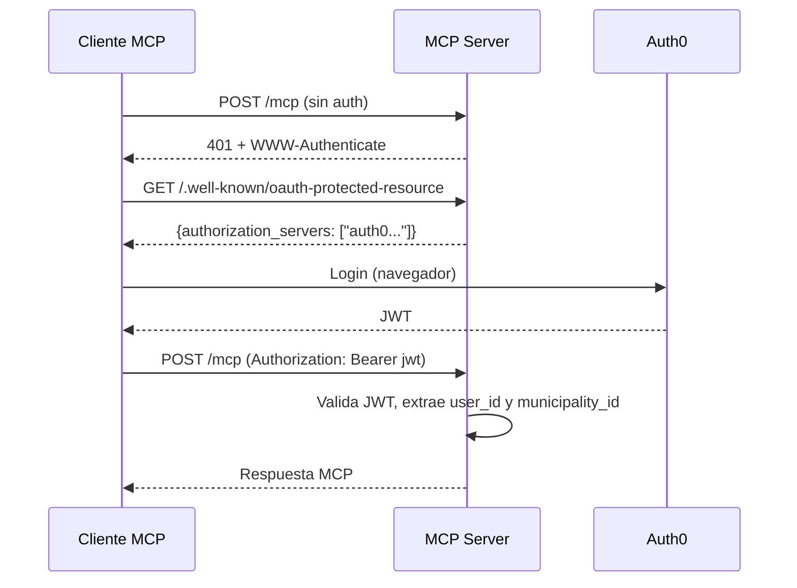

# Comunicacion entre Servicios

## Protocolos

El ecosistema GDI utiliza tres protocolos de comunicacion:

| Protocolo | Uso | Formato |
|-----------|-----|---------|
| **REST (HTTP/JSON)** | Comunicacion general entre todos los servicios | JSON sobre HTTP |
| **MCP (Model Context Protocol)** | Integracion con clientes IA (Claude, ChatGPT, Gemini) | JSON-RPC sobre HTTP |
| **S3 API** | Almacenamiento de PDFs en Cloudflare R2 | AWS S3 compatible |

## Tabla de Comunicaciones

| Origen | Destino | Protocolo | Autenticacion | Puerto destino | URL tipo |
|--------|---------|-----------|---------------|----------------|----------|
| GDI-FRONTEND | GDI-Backend | REST | Auth0 JWT (Bearer) | 8000 | Public |
| GDI-BackOffice-Front | GDI-BackOffice-Back | REST | Auth0 JWT (Bearer) | 8010 | Public |
| GDI-Backend | GDI-PDFComposer | REST | API Key (`X-API-Key`) | 8002 | Railway internal |
| GDI-Backend | GDI-Notary | REST | API Key (`X-API-Key`) | 8001 | Railway internal |
| GDI-Backend | GDI-eMailService | REST | API Key (`X-API-Key`) | 8003 | Railway internal |
| GDI-Backend | Cloudflare R2 | S3 API | Access Key + Secret Key | 443 | External (HTTPS) |
| GDI-AgenteLANG | GDI-Backend | REST | JWT / Internal API Key | 8000 | Railway internal |
| GDI-AgenteLANG | OpenRouter | REST | API Key (Bearer) | 443 | External (HTTPS) |
| GDI-AgenteLANG | PostgreSQL | TCP | Connection string | 5432 | Railway internal |
| GDI-PDFComposer | Gotenberg | REST | Sin auth (internal) | 3000 | Railway internal |
| Cliente MCP | GDI-MCP Server | MCP (JSON-RPC) | OAuth 2.0 (Auth0 JWT) | 8005 | Public |
| GDI-BackOffice-Back | PostgreSQL | TCP | Connection string | 5432 | Railway internal |
| Dashboard GDI | PostgreSQL | TCP | Connection string | 5432 | Railway internal |

## Autenticacion Inter-Servicio

### Auth0 JWT (Frontend a Backend)

Los frontends autentican usuarios mediante Auth0. El JWT se envia en el header `Authorization: Bearer <token>`. Los backends validan el token contra Auth0 JWKS.

```
Frontend → Auth0 (login) → JWT
Frontend → Backend (Authorization: Bearer <jwt>)
Backend → Auth0 JWKS (validacion)
```

### API Key (Backend a Microservicios)

La comunicacion entre el Backend y los microservicios (PDFComposer, Notary, eMailService) usa API Keys simples en el header `X-API-Key`.

```python
# Ejemplo: Backend llamando a PDFComposer
headers = {"X-API-Key": PDFCOMPOSER_API_KEY}
response = await client.post(f"{PDFCOMPOSER_URL}/generate-pdf", headers=headers, ...)
```

### OAuth 2.0 (MCP Server)

Los clientes MCP externos (Claude Code, ChatGPT, Gemini) se autentican via OAuth 2.0 con Auth0:



### REST API Publica (API Key + User ID)

La REST API del MCP Server tambien soporta autenticacion por API Key para integraciones programaticas:

```bash
curl -H "X-API-Key: sk-gdi-xxx" \
     -H "X-User-ID: uuid-del-usuario" \
     https://mcp.tu-dominio.com/api/v1/cases/search
```

## Railway Internal URLs vs Public URLs

### URLs Internas (servicio a servicio)

Los servicios dentro del mismo proyecto Railway se comunican via URLs internas. Estas no pasan por internet, lo que reduce latencia y aumenta seguridad.

```
http://{servicio}.railway.internal:{puerto}
```

**Ejemplos:**

```bash
# Backend → PDFComposer
PDFCOMPOSER_URL=http://pdfcomposer-svc.railway.internal:8002

# Backend → Notary
NOTARY_URL=http://notary-svc.railway.internal:8001

# PDFComposer → Gotenberg
GOTENBERG_URL=http://gotenberg.railway.internal:3000

# Dashboard Frontend → Dashboard Backend
BACKEND_URL=http://dashboard-backend.railway.internal:8000
```

!!! tip "Ventajas de Internal Networking"
    - Sin exposicion a internet
    - Menor latencia (misma red)
    - Sin costos de bandwidth externo
    - Nombres DNS estables

### URLs Publicas (usuario a servicio)

Los frontends y clientes externos acceden via URLs publicas de Railway:

```bash
# Frontends (navegador del usuario)
https://mi-frontend.up.railway.app     # GDI-FRONTEND
https://mi-backoffice.up.railway.app   # GDI-BackOffice-Front

# APIs publicas
https://mcp.tu-dominio.com/mcp            # MCP Server (dominio custom)
```

### Comunicacion Externa

Algunos servicios se comunican con APIs externas que siempre usan HTTPS publico:

```bash
# Cloudflare R2 (storage)
CF_R2_ENDPOINT=https://{account}.r2.cloudflarestorage.com

# Auth0 (autenticacion)
AUTH0_DOMAIN=tu-tenant.us.auth0.com

# OpenRouter (modelos IA)
OPENROUTER_API_KEY=sk-or-...

# Mailgun (emails) - via SMTP o API
SMTP_HOST=smtp.mailgun.org
```

## Patrones de Comunicacion

### Request-Response sincrono

Todas las comunicaciones entre servicios son sincronas. El servicio que inicia la llamada espera la respuesta antes de continuar.

```python
# Backend: genera PDF y luego lo firma
pdf_bytes = await call_pdfcomposer_generate_pdf(html_content)
signed_pdf = await call_notary_sign_pdf(pdf_bytes, signer_data)
await upload_to_r2(signed_pdf, filename)
```

### Polling asincrono (AIWorker)

El unico patron asincrono es el AIWorker de GDI-AgenteLANG, que hace polling cada 60 segundos sobre las tablas de documentos para generar resumenes y embeddings.

```
AIWorker (cada 60s) → PostgreSQL
  1. document_draft WHERE status='sent_to_sign' AND resume IS NULL
  2. official_documents WHERE resume IS NULL
  3. official_documents sin chunks en document_chunks
  4. official_documents tipo 'Importado' con content IS NULL
```

### Retry con fallback (Notary FULLPAGE)

Cuando Notary detecta que la ultima pagina no tiene espacio para la firma, responde con error `FULLPAGE`. El Backend agrega automaticamente una pagina en blanco y reintenta:

```
Backend → Notary: /sign-pdf (PDF original)
Notary → Backend: 400 FULLPAGE
Backend: agrega pagina en blanco
Backend → Notary: /sign-pdf (PDF aumentado)
Notary → Backend: 200 (PDF firmado)
```

## Timeouts

| Comunicacion | Timeout | Motivo |
|--------------|---------|--------|
| Frontend a Backend | 30s | Request HTTP estandar |
| Backend a PDFComposer | 60s | Generacion PDF puede ser lenta |
| Backend a Notary | 30s | Firma es rapida |
| PDFComposer a Gotenberg | 30s | Conversion HTML a PDF |
| Backend a R2 | 30s | Upload/download de archivos |
| AgenteLANG a OpenRouter | 60s | Respuesta de LLM |
