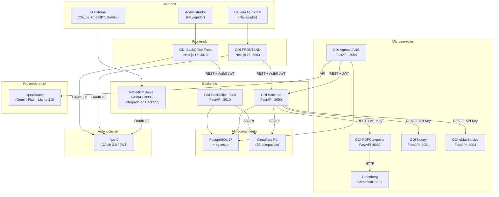
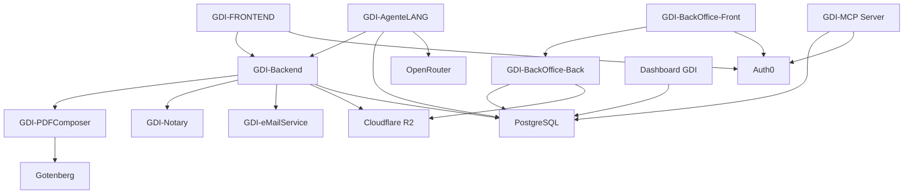

# Diagrama de Servicios

## Arquitectura Completa

## Diagrama por Capas

```mermaid
graph LR
    subgraph Presentacion["Capa de Presentacion"]
        F1["GDI-FRONTEND :3003"]
        F2["GDI-BackOffice-Front :3013"]
        F3["Dashboard Frontend :8501"]
    end

    subgraph Aplicacion["Capa de Aplicacion"]
        B1["GDI-Backend :8000"]
        B2["GDI-BackOffice-Back :8010"]
        B3["GDI-MCP Server :8005"]
        B4["Dashboard Backend :8000"]
    end

    subgraph Servicios["Capa de Microservicios"]
        S1["GDI-PDFComposer :8002"]
        S2["GDI-Notary :8001"]
        S3["GDI-eMailService :8003"]
        S4["GDI-AgenteLANG :8004"]
        S5["Gotenberg :3000"]
    end

    subgraph Datos["Capa de Datos"]
        D1["PostgreSQL + pgvector"]
        D2["Cloudflare R2"]
    end

    Presentacion --> Aplicacion
    Aplicacion --> Servicios
    Aplicacion --> Datos
    Servicios --> Datos
```

## Puertos y Tecnologias

| Servicio | Puerto | Tecnologia | Workers | Protocolo |
|----------|--------|------------|---------|-----------|
| GDI-FRONTEND | 3003 | Next.js 15 (Pages Router) | Node.js | HTTP |
| GDI-BackOffice-Front | 3013 | Next.js 15 (Pages Router) | Node.js | HTTP |
| GDI-Backend | 8000 | FastAPI + Gunicorn | 8 Uvicorn workers | HTTP |
| GDI-BackOffice-Back | 8010 | FastAPI + Uvicorn | 1 worker | HTTP |
| GDI-MCP Server | 8005 | FastAPI (integrado en Backend) | Compartido | MCP + HTTP |
| GDI-AgenteLANG | 8004 | FastAPI + Uvicorn | 1 + AIWorker background | HTTP |
| GDI-PDFComposer | 8002 | FastAPI + Gunicorn | 4 Uvicorn workers | HTTP |
| GDI-Notary | 8001 | FastAPI + Gunicorn | 3 Uvicorn workers | HTTP |
| GDI-eMailService | 8003 | FastAPI + Uvicorn | 1 worker | HTTP |
| Gotenberg | 3000 | Go + Chromium headless | - | HTTP |
| Dashboard Backend | 8000 | FastAPI + Uvicorn | 1 worker | HTTP |
| Dashboard Frontend | 8501 | Streamlit | 1 worker | HTTP |
| PostgreSQL | 5432 | PostgreSQL 17 + pgvector | Railway managed | TCP |

## Dependencias entre Servicios

!!! note "MCP Server integrado"
    El MCP Server (puerto 8005) esta integrado dentro del repositorio GDI-Backend en la carpeta `api_gateway/`. No es un servicio separado en Railway, sino un modulo del Backend que escucha en un puerto adicional.
