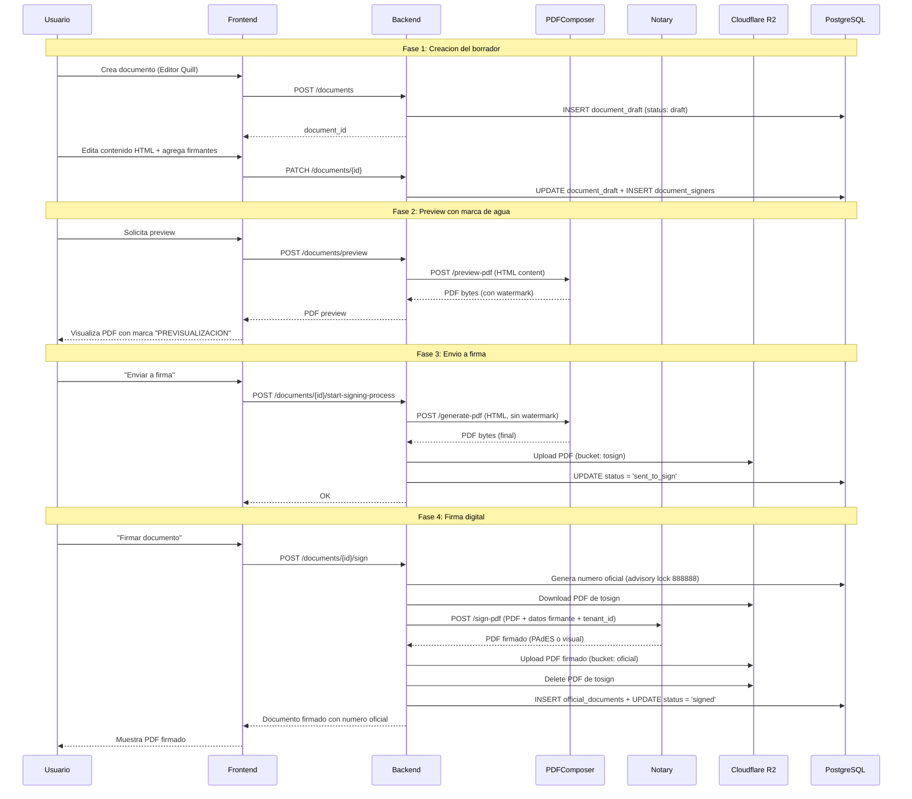
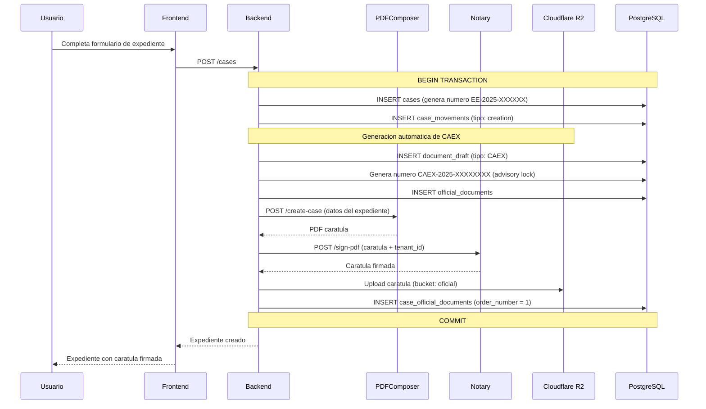
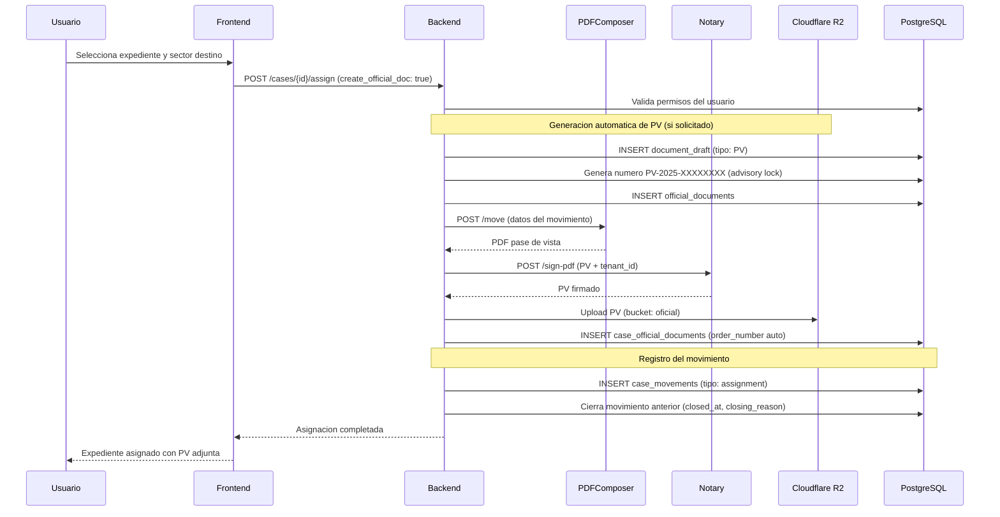
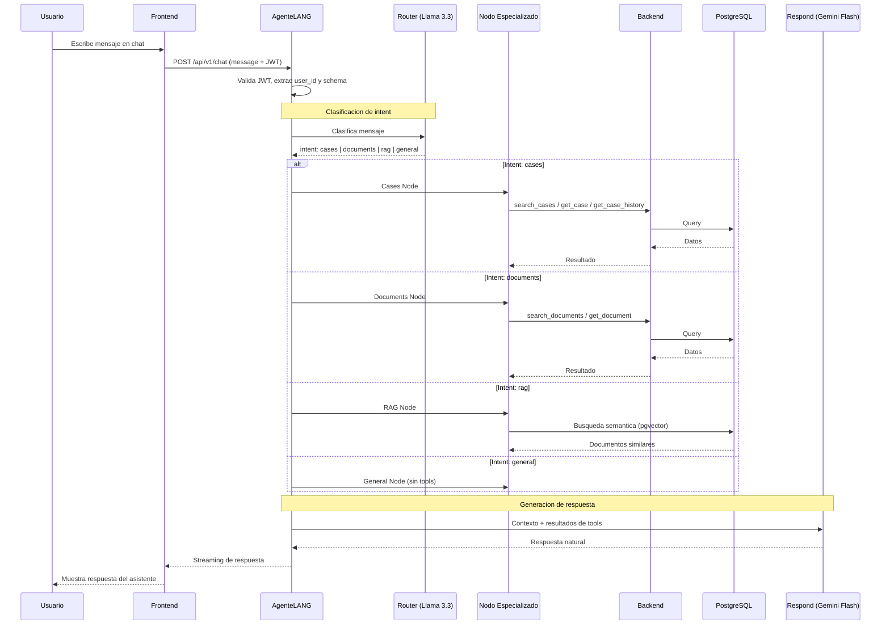
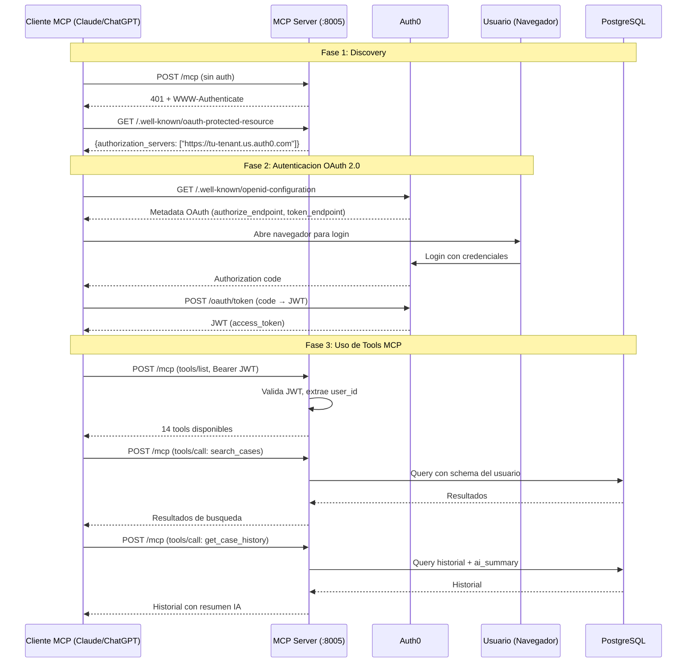
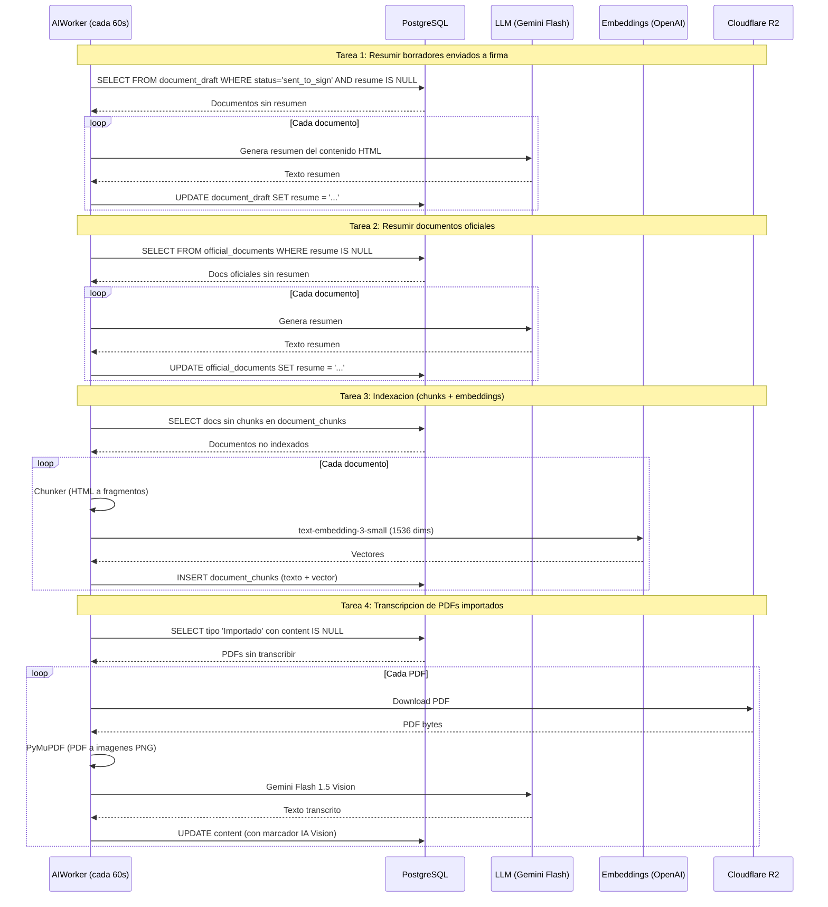

# Flujos Principales

## 1. Crear Documento y Firmar

El flujo completo de un documento desde su creacion como borrador hasta su firma oficial y almacenamiento.



**Formato de numero oficial:**

```
{TIPO}-{ANO}-{SECUENCIA:08d}-{CIUDAD}-{DEPT}
Ejemplo: IF-2025-00000034-SMG-ADGEN
```

**Manejo FULLPAGE:** Si Notary responde `400 FULLPAGE` (pagina llena), el Backend agrega una pagina en blanco y reintenta automaticamente.

---

## 2. Crear Expediente con Caratula CAEX

La creacion de un expediente genera automaticamente una caratula oficial (documento CAEX) firmada.



La caratula CAEX siempre es el **primer documento** del expediente (`order_number = 1`). Contiene:

- Numero de expediente
- Tipo y motivo
- Area iniciadora
- Creador
- Fecha y hora (UTC)
- Logo municipal

---

## 3. Asignar Expediente con PV Automatica

Al asignar un expediente a otro sector, opcionalmente se genera un documento PV (Pase/Vista) automatico.



El documento PV contiene:

- Numero de expediente
- Tipo de movimiento (Asignacion)
- Area requiriente (DE)
- Area receptora (A)
- Motivo del movimiento

---

## 4. Chat con Agente IA

El agente IA utiliza LangGraph con un Router que clasifica la intencion del usuario y deriva al nodo especializado.



**Modelos utilizados:**

| Modelo | Uso | Costo |
|--------|-----|-------|
| Llama 3.3 70B (FREE) | Router - Clasificacion de intent | Gratis |
| Gemini Flash 2.0 | Nodos especializados + Respuesta final | USD 0.10/1M tokens input |

**Case Chat** (`/api/v1/cases/{id}/chat`): Un chat focalizado que precarga todo el contexto del expediente. No necesita Router porque todas las consultas son sobre ese expediente.

---

## 5. MCP Server (IA Externa)

Flujo de conexion de un cliente MCP externo (Claude Code, ChatGPT, Gemini) al servidor MCP de GDI.



**14 Tools MCP disponibles:**

| Categoria | Tools | Descripcion |
|-----------|-------|-------------|
| Expedientes | `search_cases`, `get_case`, `get_case_history`, `get_case_documents`, `get_case_permissions` | Busqueda y consulta de expedientes |
| Documentos | `search_documents`, `get_document`, `get_document_content`, `get_pending_signatures` | Busqueda y consulta de documentos |
| Sistema | `get_document_types`, `get_sectors`, `get_user_info`, `get_case_templates` | Informacion del sistema |
| Utilidades | `get_agent_guide` | Guia completa para el agente |

---

## 6. Indexacion RAG (AIWorker Background)

El AIWorker de GDI-AgenteLANG procesa documentos en background para habilitar busqueda semantica.



**Control de costos:** El AIWorker incluye tracking de costos por schema con limites diarios y mensuales configurables en la tabla `ai_usage_limits`.
