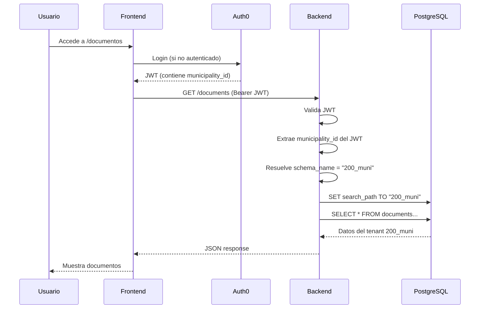

# Arquitectura Multi-Tenant

## Concepto

GDI Latam usa una estrategia de **schema-per-tenant** en PostgreSQL. Cada municipio tiene su propio schema de base de datos, lo que garantiza aislamiento completo de datos sin necesidad de bases de datos separadas.

```
PostgreSQL (Railway)
│
├── public                    # Tablas globales (compartidas)
│   ├── roles                 # Roles del sistema
│   ├── global_document_types # Catalogo de tipos de documento
│   ├── global_case_templates # Catalogo de templates de expediente
│   ├── municipalities        # Registro de municipalidades
│   ├── document_display_states
│   ├── user_registry         # Registro global de usuarios
│   ├── api_keys              # API Keys para REST API
│   ├── api_key_users         # Usuarios autorizados por API Key
│   └── global_registry_families
│
├── 200_muni                  # Municipio "Test" (33 tablas)
│   ├── users
│   ├── departments
│   ├── sectors
│   ├── document_draft
│   ├── official_documents
│   ├── cases
│   ├── case_movements
│   ├── settings              # Config del municipio (logo, colores, ciudad)
│   ├── document_chunks       # Embeddings para RAG
│   └── ... (33 tablas total)
│
├── 200_muni_audit            # Auditoria del municipio "Test"
│   └── audit_log
│
├── 200_salta                 # Otro municipio (misma estructura)
│   └── ... (33 tablas)
│
└── 200_salta_audit
    └── audit_log
```

## Nomenclatura de Schemas

Los schemas siguen el patron `{numero}_{nombre}`:

| Schema | Municipio | Uso |
|--------|-----------|-----|
| `200_muni` | Municipio de prueba | Desarrollo y demos |
| `200_muni_audit` | Auditoria de test | Logs de cambios |

Cada municipio nuevo recibe un numero unico y su nombre como identificador.

## Tenant Middleware

### GDI-Backend

El Backend principal extrae el `schema_name` del JWT del usuario autenticado via Auth0. El middleware `TenantMiddleware` lo inyecta en `request.state.schema_name` para que todos los endpoints lo utilicen.

```python
# Flujo de extraccion de tenant
# 1. Usuario envia JWT en Authorization header
# 2. Auth middleware valida JWT contra Auth0
# 3. Del JWT se obtiene user_id y municipality_id
# 4. Con municipality_id se busca el schema correspondiente
# 5. Se inyecta en request.state.schema_name

# En endpoints:
@router.get("/documents")
async def list_documents(request: Request):
    schema_name = request.state.schema_name
    documents = get_documents(schema_name=schema_name)
    return documents
```

### GDI-BackOffice-Back

El BackOffice soporta tres modos de autenticacion para determinar el tenant:

=== "API Key"
    ```
    Headers: X-API-Key + X-Tenant-Schema + X-User-ID
    ```
    El schema se toma directamente del header `X-Tenant-Schema`.

=== "Testing Mode"
    ```
    TESTING_MODE=true
    Headers: X-User-ID o Bearer UUID
    Schema fijo: 200_muni
    ```
    En modo testing, el schema siempre es `200_muni`.

=== "JWT (Produccion)"
    ```
    Headers: Authorization: Bearer <jwt> + X-Tenant-Schema
    ```
    El JWT valida la identidad y el header indica el schema.

## Regla keyword-only: schema_name

!!! danger "Regla critica"
    El parametro `schema_name` es **keyword-only** en TODAS las funciones que acceden a base de datos. Esto se implementa con el asterisco `*` en la firma de la funcion.

### Definicion

```python
# El * antes de schema_name lo hace keyword-only
def execute_query(query: str, params: tuple = None, *, schema_name: str):
    """Ejecuta query en el schema indicado."""
    with get_connection() as conn:
        conn.execute(f'SET search_path TO "{schema_name}"')
        return conn.execute(query, params)
```

### Uso correcto vs incorrecto

```python
# CORRECTO - siempre usar schema_name=
result = execute_query(
    "SELECT * FROM users WHERE user_id = %s",
    (user_id,),
    schema_name=schema_name
)

# INCORRECTO - causa TypeError en runtime
result = execute_query(
    "SELECT * FROM users WHERE user_id = %s",
    (user_id,),
    schema_name  # TypeError: takes N positional arguments but M were given
)
```

### Funciones principales con keyword-only

```python
# database.py
execute_query(query, params, *, schema_name: str)
execute_update(query, params, *, schema_name: str)
execute_transaction(*, schema_name: str)
execute_single_update(query, params, *, schema_name: str)
check_user_exists(user_id, *, schema_name: str)
check_document_exists(document_id, *, schema_name: str)

# shared/utils.py
get_authenticated_user(user_id, *, schema_name: str)

# services/storage/cloudflare.py
get_tenant_r2_client(*, schema_name: str)
```

### Por que keyword-only

1. **Previene SQL injection de tenant** (tenant leakage entre municipios)
2. **Errores detectados en runtime** si se olvida el `=`
3. **Imposible confundir orden de parametros** cuando hay multiples argumentos

## Ejemplo de Query con Schema

Los schemas de municipio pueden empezar con numero (ej: `200_muni`), lo que requiere comillas dobles en SQL:

```sql
-- Query directa con schema
SELECT * FROM "200_muni".official_documents WHERE document_id = $1;

-- SET search_path (usado internamente)
SET search_path TO "200_muni";
SELECT * FROM official_documents WHERE document_id = $1;
```

En el codigo Python, el patron es:

```python
async def get_document(document_id: str, *, schema_name: str):
    query = """
        SELECT d.*, o.official_number
        FROM document_draft d
        LEFT JOIN official_documents o ON d.document_id = o.document_id
        WHERE d.document_id = %s
    """
    return execute_query(query, (document_id,), schema_name=schema_name)
```

## Pool de Conexiones

### GDI-Backend (asyncpg)

El Backend principal usa un pool asincrono de conexiones. Cada conexion configura el `search_path` al schema del tenant antes de ejecutar queries.

```python
# shared/database.py
pool = await asyncpg.create_pool(
    dsn=DATABASE_URL,
    min_size=2,
    max_size=20,
)

async def execute_query(query, params=None, *, schema_name: str):
    async with pool.acquire() as conn:
        await conn.execute(f'SET search_path TO "{schema_name}"')
        return await conn.fetch(query, *params)
```

### GDI-BackOffice-Back (psycopg2)

El BackOffice usa psycopg2 sincrono con pool de conexiones:

```python
# database.py
from psycopg2 import pool

connection_pool = pool.ThreadedConnectionPool(
    minconn=1,
    maxconn=10,
    dsn=DATABASE_URL
)

def execute_query(query, params=None, *, schema_name: str):
    conn = connection_pool.getconn()
    try:
        with conn.cursor() as cur:
            cur.execute(f'SET search_path TO "{schema_name}"')
            cur.execute(query, params)
            return cur.fetchall()
    finally:
        connection_pool.putconn(conn)
```

### GDI-AgenteLANG (asyncpg)

El agente IA usa su propio pool para acceso directo a la BD del tenant:

```python
# app/db/pool.py
pool = await asyncpg.create_pool(dsn=DATABASE_URL, min_size=1, max_size=5)
```

## Buckets R2 por Tenant

El almacenamiento en Cloudflare R2 tambien es por tenant. Los nombres de bucket incluyen el identificador del municipio:

```
Cloudflare R2
├── tenant-test-tosign     # PDFs pendientes de firma (200_muni)
├── tenant-test-oficial    # PDFs firmados (200_muni)
├── tenant-salta-tosign    # PDFs pendientes (200_salta)
└── tenant-salta-oficial   # PDFs firmados (200_salta)
```

La configuracion de buckets esta en la tabla `settings` de cada schema:

```sql
SELECT bucket_oficial, bucket_tosign FROM "200_muni".settings;
-- tenant-test-oficial, tenant-test-tosign
```

## Flujo Completo: Request Multi-Tenant


