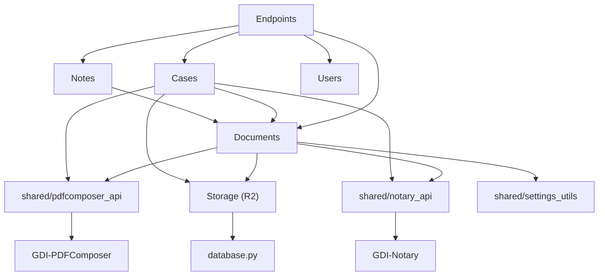

# Capa de Servicios

Toda la logica de negocio del backend reside en `services/`. Los endpoints son **thin controllers** que solo validan input y delegan a servicios.

## Mapa de Servicios

```
services/
├── documents/          # Modulo principal (~30 archivos)
│   ├── core/           # Repository, Builder, Validator, Queries
│   ├── catalog/        # Tipos, estados, metadata
│   ├── lifecycle/      # Creacion, edicion, eliminacion, rechazo
│   ├── signing/        # Firma digital, numerador, unified
│   ├── preview/        # Preview PDF con PDFComposer
│   ├── retrieval/      # Busqueda, detalles, contenido
│   ├── importing/      # PDFs externos
│   └── pdf/            # Generacion PDF final
├── cases/              # Expedientes (~12 archivos)
│   ├── core.py         # Creacion base (sync)
│   ├── cover_creator.py    # Caratulas CAEX automaticas
│   ├── transfer.py     # Transferencias y asignaciones
│   ├── transfer_document_creator.py  # Pases PV automaticos
│   ├── permissions.py  # Permisos por sector
│   └── history.py      # Historial de movimientos
├── notes/              # Notas internas (~7 archivos)
│   ├── recipients.py   # Destinatarios TO/CC/BCC
│   ├── validation.py   # Validacion de recipients
│   └── retrieval.py    # Bandejas recibidas/enviadas
├── storage/            # Almacenamiento
│   └── cloudflare.py   # Cliente R2 multi-tenant
├── shared/             # Servicios compartidos
│   ├── pdfcomposer_api.py  # Cliente PDFComposer
│   ├── notary_api.py       # Cliente Notary
│   ├── settings_utils.py   # Config del tenant
│   ├── signer_data.py      # Datos del firmante
│   ├── user_data.py        # Datos del usuario
│   └── retry.py            # Logica de reintentos
└── users/              # Usuarios (~8 archivos)
    ├── profile.py      # Perfil completo
    ├── search.py       # Busqueda de usuarios
    └── document_queries.py  # Documentos del usuario
```

## Dependencias entre Servicios



## Patron Comun

Todos los servicios siguen el mismo patron:

```python
# services/documents/lifecycle/creation.py

def create_document(
    document_type_acronym: str,
    reference: str,
    creator_id: str,
    *,
    schema_name: str,           # Siempre keyword-only
    recipients: Optional[Dict] = None
) -> Dict[str, Any]:
    """
    Crea un nuevo documento en estado draft.

    Raises:
        ValidationError: Si los datos son invalidos
        DatabaseError: Si falla la operacion en BD
    """
    # 1. Validar inputs
    _validate_creation_inputs(document_type_acronym, reference, creator_id)

    # 2. Logica de negocio
    with get_db_connection(schema_name) as conn:
        with conn.cursor() as cursor:
            # ... operaciones
            conn.commit()

    # 3. Retornar resultado tipado
    return {"success": True, "document_id": result['document_id']}
```

!!! warning "Regla critica: schema_name"
    **Todas** las funciones que acceden a BD usan `schema_name` como parametro keyword-only (con `*`). Nunca pasarlo posicional.

    ```python
    # CORRECTO
    create_document("INF", "ref", user_id, schema_name=schema_name)

    # INCORRECTO - causa TypeError en runtime
    create_document("INF", "ref", user_id, schema_name)
    ```

## Imports

```python
# Recomendado (especifico)
from services.documents.lifecycle.creation import create_document
from services.documents.signing.signing import sign_document

# Tambien funciona (via __init__.py)
from services.documents import create_document, sign_document
```
