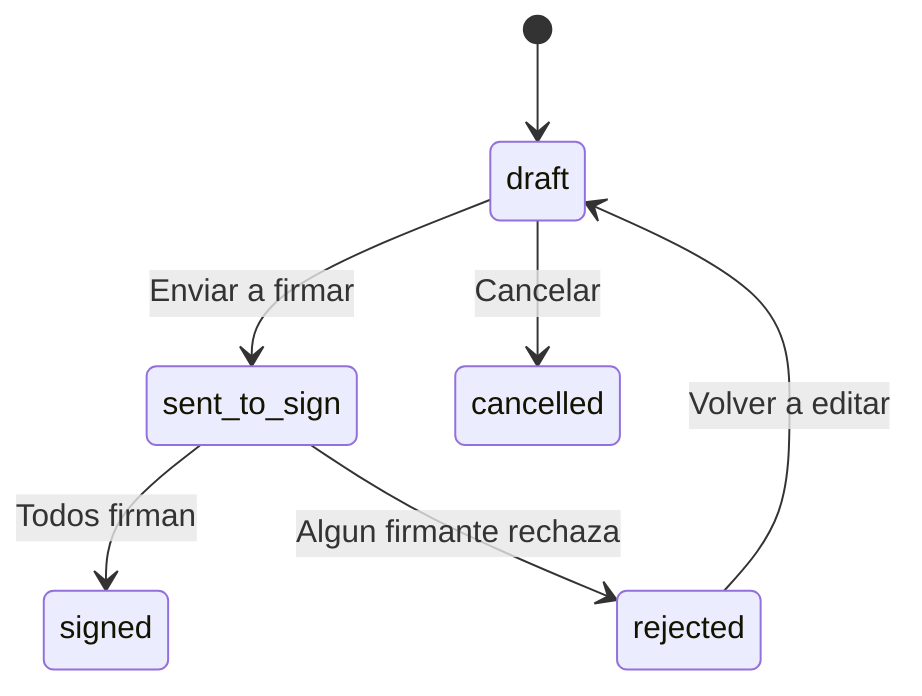
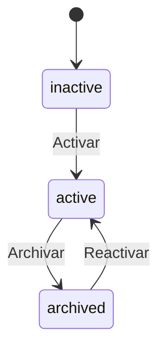

# ENUMs y Tipos

Todos los tipos enumerados se definen en el schema `public` y son compartidos por todos los municipios. Se crean en `01-install.sql`.

## Resumen

| ENUM | Valores | Uso |
|------|---------|-----|
| `country_enum` | 11 paises | `municipalities.country` |
| `document_status` | 5 estados | `document_draft.status` |
| `document_signer_status` | 3 estados | `document_signers.status` |
| `movement_type` | 9 tipos | `case_movements.type` |
| `status_case` | 3 estados | `cases.status` |
| `case_creation_channel` | 3 canales | `case_templates.creation_channel` |
| `document_type_source` | 3 fuentes | `document_types.type`, `global_document_types.type` |

---

## country_enum

Codigos ISO de paises soportados (LATAM).

```sql
CREATE TYPE "public"."country_enum" AS ENUM (
    'AR',   -- Argentina
    'BR',   -- Brasil
    'UY',   -- Uruguay
    'CL',   -- Chile
    'PY',   -- Paraguay
    'BO',   -- Bolivia
    'PE',   -- Peru
    'EC',   -- Ecuador
    'CO',   -- Colombia
    'VE',   -- Venezuela
    'MX'    -- Mexico
);
```

**Usado en:** `municipalities.country`

---

## document_status

Ciclo de vida de un documento borrador.

```sql
CREATE TYPE "public"."document_status" AS ENUM (
    'draft',          -- Borrador (editable)
    'sent_to_sign',   -- Enviado a firmar (no editable)
    'signed',         -- Firmado por todos los firmantes
    'rejected',       -- Rechazado por algun firmante
    'cancelled'       -- Cancelado por el creador
);
```

**Usado en:** `document_draft.status`



---

## document_signer_status

Estado de firma de cada firmante individual.

```sql
CREATE TYPE "public"."document_signer_status" AS ENUM (
    'pending',    -- Esperando firma
    'signed',     -- Ya firmo
    'rejected'    -- Rechazo firmar
);
```

**Usado en:** `document_signers.status`

---

## movement_type

Tipos de movimientos en el historial de expedientes.

```sql
CREATE TYPE "public"."movement_type" AS ENUM (
    'creation',               -- Creacion del expediente
    'transfer',               -- Transferencia a otro sector
    'assignment',             -- Asignacion a usuario especifico
    'assignment_close',       -- Cierre de asignacion
    'status_change',          -- Cambio de estado (active/inactive/archived)
    'document_link',          -- Vinculacion de documento oficial
    'subsanacion',            -- Subsanacion de documento erroneo
    'document_proposal',      -- Propuesta de vinculacion de documento
    'document_proposal_reject' -- Rechazo de propuesta
);
```

**Usado en:** `case_movements.type`

| Valor | Descripcion | Genera PV |
|-------|-------------|-----------|
| `creation` | Movimiento inicial al crear expediente | No |
| `transfer` | Transferencia a otro sector (genera Pase) | Si |
| `assignment` | Asignacion a un usuario dentro del sector | No |
| `assignment_close` | Cierre de una asignacion | No |
| `status_change` | Cambio de estado del expediente | No |
| `document_link` | Vinculacion de un documento oficial | No |
| `subsanacion` | Correccion de un documento erroneo | No |
| `document_proposal` | Propuesta de vincular un borrador | No |
| `document_proposal_reject` | Rechazo de una propuesta | No |

---

## status_case

Estados del ciclo de vida de un expediente.

```sql
CREATE TYPE "public"."status_case" AS ENUM (
    'inactive',   -- Inactivo (recien creado, sin activar)
    'active',     -- Activo (en tramite)
    'archived'    -- Archivado (finalizado)
);
```

**Usado en:** `cases.status`



---

## case_creation_channel

Canal por el cual se puede crear un expediente de este tipo.

```sql
CREATE TYPE "public"."case_creation_channel" AS ENUM (
    'web',    -- Solo desde el frontend web
    'api',    -- Solo desde la API REST/MCP
    'both'    -- Ambos canales
);
```

**Usado en:** `case_templates.creation_channel`

---

## document_type_source

Origen/formato del contenido del documento.

```sql
CREATE TYPE "public"."document_type_source" AS ENUM (
    'HTML',       -- Creado con editor HTML (TipTap)
    'Importado',  -- PDF subido externamente
    'NOTA'        -- Nota oficial con destinatarios
);
```

**Usado en:** `document_types.type`, `global_document_types.type`

| Valor | Descripcion | Ejemplo |
|-------|-------------|---------|
| `HTML` | Documento creado con el editor integrado | Informe (IF), Resolucion (RESOL) |
| `Importado` | PDF externo subido al sistema | Oficio Judicial (OFJUD), Plano (PLANO) |
| `NOTA` | Nota con sistema de destinatarios (TO/CC/BCC) | Nota (NOTA) |

---

## Tipos de Datos Especiales

Ademas de los ENUMs, el sistema usa estos tipos de PostgreSQL:

| Tipo | Extension | Uso |
|------|-----------|-----|
| `vector(1536)` | pgvector | Embeddings en `document_chunks.embedding` |
| `UUID` | built-in | Primary keys y foreign keys |
| `JSONB` | built-in | Contenido de documentos, schemas de datos, configuracion |
| `UUID[]` | built-in | Array de sector IDs en `official_documents.signer_sector_ids` |
| `TEXT[]` | built-in | Array de campos modificados en `audit_log.changed_fields` |

### Ejemplo: vector(1536)

```sql
-- Columna de embedding para busqueda semantica (RAG)
"embedding" vector(1536)

-- Indice HNSW para busqueda eficiente
CREATE INDEX "idx_{SCHEMA_NAME}_chunks_embedding"
    ON "{SCHEMA_NAME}"."document_chunks"
    USING hnsw ("embedding" vector_cosine_ops);
```

### Ejemplo: UUID[]

```sql
-- Array de sector_ids pre-calculado para filtro eficiente
"signer_sector_ids" UUID[]

-- Indice GIN para busqueda en el array
CREATE INDEX "idx_{SCHEMA_NAME}_official_docs_signer_sectors"
    ON "{SCHEMA_NAME}"."official_documents"
    USING GIN ("signer_sector_ids");
```
