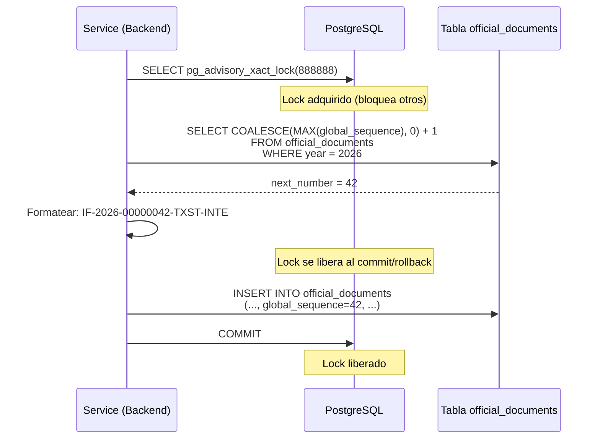

# Sistema de Numeracion

El sistema genera numeros oficiales unicos para todos los documentos del sistema. Usa **advisory locks** de PostgreSQL para prevenir race conditions en entornos concurrentes.

## Formato del Numero Oficial

```
{TIPO}-{ANIO}-{SECUENCIA:08d}-{MUNICIPIO}-{DEPARTAMENTO}
```

| Componente | Ejemplo | Origen |
|------------|---------|--------|
| TIPO | `IF`, `CAEX`, `PV` | Acronimo del tipo de documento |
| ANIO | `2026` | Anio actual |
| SECUENCIA | `00000001` | Secuencia global (8 digitos, zero-padded) |
| MUNICIPIO | `TXST` | Acronimo del municipio (de `public.municipalities`) |
| DEPARTAMENTO | `INTE` | Acronimo del departamento del numerador |

**Ejemplos:**

```
IF-2026-00000001-TXST-INTE       -- Primer informe del anio
NOTA-2026-00000002-TXST-LEGAL    -- Segunda nota (secuencia global)
CAEX-2026-00000003-TXST-INNO     -- Caratula de expediente
PV-2026-00000004-TXST-INNO       -- Pase de expediente
RESOL-2026-00000005-TXST-HAC     -- Resolucion
```

## Secuencia Global

La secuencia es **global por anio**: todos los tipos de documentos comparten la misma secuencia. Esto garantiza:

- No hay numeros duplicados entre tipos de documento
- Orden cronologico unico entre todos los documentos del municipio
- Trazabilidad simple (el numero mas alto = ultimo documento numerado)

La secuencia se resetea a 1 al cambiar de anio.

## Advisory Lock

### Por que Advisory Lock

PostgreSQL sequences (`nextval`) no sirven porque:

1. No se resetean por anio automaticamente
2. Si una transaccion hace rollback, el numero se pierde (huecos permanentes)

El advisory lock permite:

- Serializar el acceso al SELECT MAX + INSERT
- Reutilizar numeros en caso de rollback (no hay huecos)
- Lock ultra corto (10-20ms)

### Lock IDs

| Lock ID | Uso | Donde se usa |
|---------|-----|--------------|
| `888888` | Numeracion de documentos oficiales | `shared/numbering.py` |
| `999999` | Numeracion de expedientes | `database.py` |

!!! warning "Lock IDs fijos"
    Los IDs `888888` y `999999` son arbitrarios pero deben ser unicos en todo el sistema. No cambiar sin verificar que no hay conflictos.

### Flujo de Numeracion



### Codigo (Python)

El modulo `shared/numbering.py` del Backend centraliza toda la logica:

```python
# Lock ID unico para numeracion de documentos oficiales
OFFICIAL_DOCUMENTS_LOCK_ID = 888888

async def generate_official_number(
    document_type_acronym: str,
    user_id: str,
    year: int,
    connection=None,
    *,
    schema_name: str    # SIEMPRE keyword-only
) -> Tuple[str, str, int]:
    """
    Genera un numero oficial unico.

    Returns:
        (official_number, department_id, global_sequence)
    """
    cursor = connection.cursor()

    # Paso 1: Obtener datos del usuario
    # - city_acronym de public.municipalities
    # - dept_acronym del departamento del usuario
    cursor.execute("""
        SELECT acronym as city_acronym
        FROM public.municipalities
        WHERE schema_name = %s
    """, (schema_name,))
    city_acronym = cursor.fetchone()['city_acronym']

    cursor.execute("""
        SELECT d.acronym as dept_acronym, d.id as department_id
        FROM users u
        LEFT JOIN sectors s ON u.sector_id = s.id
        LEFT JOIN departments d ON s.department_id = d.id
        WHERE u.id = %s
    """, (user_id,))
    user_info = cursor.fetchone()

    # Paso 2: Advisory lock + generar numero
    cursor.execute(f"SELECT pg_advisory_xact_lock({OFFICIAL_DOCUMENTS_LOCK_ID})")

    cursor.execute("""
        SELECT COALESCE(MAX(global_sequence), 0) + 1 as next_number
        FROM official_documents
        WHERE year = %s AND global_sequence IS NOT NULL
    """, (year,))
    next_number = cursor.fetchone()['next_number']

    # Paso 3: Formatear
    official_number = (
        f"{document_type_acronym}-{year}-{next_number:08d}"
        f"-{city_acronym}-{dept_acronym}"
    )

    return official_number, department_id, next_number
```

!!! note "schema_name keyword-only"
    La funcion `generate_official_number` recibe `schema_name` despues de `*`, lo que lo hace keyword-only. Siempre debe llamarse como `schema_name=schema_name`.

## Numeracion de Expedientes

Los expedientes usan un sistema similar con el lock ID `999999`:

```
EE-{ANIO}-{SECUENCIA:06d}-{MUNICIPIO}-{DEPARTAMENTO}
```

**Ejemplo:** `EE-2026-000001-TXST-INTE`

La secuencia de expedientes es independiente de la de documentos oficiales.

```python
def get_next_case_sequence(year: int = None, *, schema_name: str) -> int:
    """Obtener siguiente numero secuencial para expedientes."""
    with get_db_connection(schema_name) as conn:
        with conn.cursor() as cursor:
            # Lock exclusivo para expedientes (ID diferente)
            cursor.execute("SELECT pg_advisory_xact_lock(999999)")

            cursor.execute("""
                SELECT COALESCE(MAX(
                    CAST(SUBSTRING(case_number FROM '\\d{4}-(\\d+)-') AS INTEGER)
                ), 0) + 1 as next_sequence
                FROM cases
                WHERE EXTRACT(YEAR FROM created_at) = %s
            """, (year,))
            result = cursor.fetchone()
            conn.commit()

            return result['next_sequence']
```

## Documentos Automaticos

Dos tipos de documentos se generan automaticamente y usan el mismo sistema de numeracion:

| Tipo | Acronimo | Cuando se genera | Generador |
|------|----------|------------------|-----------|
| Caratula | CAEX | Al crear un expediente | `services/cases/cover_creator.py` |
| Pase | PV | Al transferir un expediente | `services/cases/transfer_document_creator.py` |

Ambos llaman a `generate_official_number()` del modulo `shared/numbering.py`.

## Tabla Resumen

| Aspecto | Documentos Oficiales | Expedientes |
|---------|---------------------|-------------|
| Lock ID | 888888 | 999999 |
| Formato | `{TIPO}-{ANIO}-{SEQ:08d}-{MUNI}-{DEPT}` | `EE-{ANIO}-{SEQ:06d}-{MUNI}-{DEPT}` |
| Secuencia | Global por anio (8 digitos) | Global por anio (6 digitos) |
| Columna | `official_documents.global_sequence` | Extraida de `cases.case_number` |
| Modulo | `shared/numbering.py` | `database.py` |
| Tipo lock | `pg_advisory_xact_lock` | `pg_advisory_xact_lock` |
| Duracion lock | ~10-20ms | ~10-20ms |
