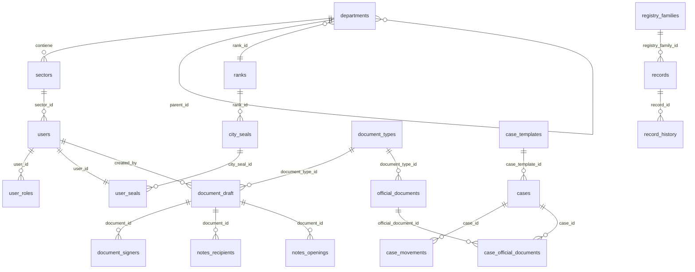

# Schema Municipio

Cada municipio tiene su propio schema PostgreSQL con **33 tablas** organizadas en 9 grupos funcionales. El nombre del schema sigue la convencion `{numero}_{acronimo}`, por ejemplo: `200_muni`, `201_otra`.

## Resumen por Grupo

| Grupo | Tablas | Descripcion |
|-------|--------|-------------|
| A - Estructura Organizacional | 2 | departments, sectors |
| B - Usuarios | 5 | users, user_roles, user_seals, user_sector_permissions, estado_users |
| C - Rangos y Sellos | 2 | ranks, city_seals |
| D - Documentos | 7 | document_types, dtabr, edts, document_draft, document_signers, document_rejections, official_documents |
| E - Expedientes | 6 | case_templates, ctad, cases, case_movements, case_official_documents, case_proposed_documents |
| F - Configuracion | 1 | settings |
| G - Agente IA | 1 | document_chunks |
| H - Notas | 2 | notes_recipients, notes_openings |
| I - Registros | 7 | registry_families, registry_family_permissions, records, record_history, record_relations, record_case_links, record_document_links |

## Diagrama ER Simplificado



---

## Grupo A: Estructura Organizacional

### TABLA 1: departments

Departamentos del municipio. Soporta jerarquia via `parent_id` (self-referencing).

| Columna | Tipo | Nullable | Default | Descripcion |
|---------|------|----------|---------|-------------|
| `id` | UUID | NO | `gen_random_uuid()` | PK |
| `name` | VARCHAR(100) | NO | - | Nombre del departamento |
| `acronym` | VARCHAR(20) | SI | - | Acronimo (ej: INTE, LEGAL) |
| `parent_id` | UUID | SI | - | FK self-ref para jerarquia |
| `rank_id` | UUID | SI | - | FK a `ranks` (rango jerarquico del depto) |
| `head_user_id` | UUID | SI | - | Jefe del departamento |
| `primary_color` | VARCHAR(7) | SI | - | Color hex (ej: #2C3E50) |
| `is_active` | BOOLEAN | NO | `true` | Si esta activo |
| `start_date` | TIMESTAMPTZ | NO | `NOW()` | Inicio de vigencia |
| `end_date` | TIMESTAMPTZ | SI | - | Fin de vigencia |
| `created_at` | TIMESTAMPTZ | NO | `NOW()` | Fecha de creacion |

**Constraints:** PK `id`, FK `parent_id` -> self, FK `rank_id` -> `ranks(id)` (diferida)

### TABLA 2: sectors

Sectores dentro de cada departamento. Cada departamento tiene al menos un sector `PRIV` (privado).

| Columna | Tipo | Nullable | Default | Descripcion |
|---------|------|----------|---------|-------------|
| `id` | UUID | NO | `gen_random_uuid()` | PK |
| `department_id` | UUID | NO | - | FK a `departments` |
| `acronym` | VARCHAR(10) | NO | - | Tipo: PRIV, MESA, ADMIN |
| `primary_color` | VARCHAR(7) | SI | - | Color hex |
| `is_active` | BOOLEAN | NO | `true` | Si esta activo |
| `start_date` | TIMESTAMPTZ | NO | `NOW()` | Inicio de vigencia |
| `end_date` | TIMESTAMPTZ | SI | - | Fin de vigencia |
| `created_at` | TIMESTAMPTZ | NO | `NOW()` | Fecha de creacion |

**Constraints:** PK `id`, FK `department_id` -> `departments(id)`, UNIQUE (`department_id`, `acronym`)

---

## Grupo B: Usuarios

### TABLA 3: users

Usuarios del municipio. Cada usuario pertenece a un sector.

| Columna | Tipo | Nullable | Default | Descripcion |
|---------|------|----------|---------|-------------|
| `id` | UUID | NO | `gen_random_uuid()` | PK |
| `auth_id` | TEXT | SI | - | ID de Auth0 |
| `email` | TEXT | NO | - | Email (unique) |
| `full_name` | VARCHAR(150) | NO | - | Nombre completo |
| `profile_picture_url` | TEXT | SI | - | URL foto de perfil (Auth0) |
| `CountryID` | VARCHAR(20) | SI | - | Documento de identidad |
| `sector_id` | UUID | SI | - | FK a `sectors` |
| `estado` | INT | NO | `1` | Estado del usuario (FK implicita a estado_users) |
| `last_access` | TIMESTAMPTZ | SI | - | Ultimo acceso |
| `can_global_search_documents` | BOOLEAN | NO | `true` | Permiso de busqueda global de docs |
| `can_global_search_cases` | BOOLEAN | NO | `true` | Permiso de busqueda global de expedientes |
| `created_at` | TIMESTAMPTZ | NO | `NOW()` | Fecha de creacion |

**Constraints:** PK `id`, UNIQUE `email`, FK `sector_id` -> `sectors(id)`

**Indices:** `idx_{schema}_users_email`, `idx_{schema}_users_sector`

!!! info "Trigger de sincronizacion"
    Al insertar, actualizar o eliminar un usuario, el trigger `trg_sync_user_registry` sincroniza automaticamente `public.user_registry`.

### TABLA 4: user_roles

Asignacion de roles a usuarios. Un usuario puede tener un rol (tipicamente Funcionario o Administrador).

| Columna | Tipo | Nullable | Default | Descripcion |
|---------|------|----------|---------|-------------|
| `id` | UUID | NO | `gen_random_uuid()` | PK |
| `user_id` | UUID | NO | - | FK a `users` |
| `role_id` | UUID | NO | - | FK a `public.roles` |
| `created_at` | TIMESTAMPTZ | NO | `NOW()` | Fecha de creacion |

**Constraints:** PK `id`, UNIQUE (`user_id`, `role_id`), FK a `users` y `public.roles`

### TABLA 5: user_seals

Asigna exactamente un sello de firma por usuario. Relacion 1:1 (UNIQUE en `user_id`).

| Columna | Tipo | Nullable | Default | Descripcion |
|---------|------|----------|---------|-------------|
| `id` | UUID | NO | `gen_random_uuid()` | PK |
| `user_id` | UUID | NO | - | FK a `users` (UNIQUE) |
| `city_seal_id` | INT | NO | - | FK a `city_seals` |
| `created_at` | TIMESTAMPTZ | NO | `NOW()` | Fecha de creacion |

**Constraints:** PK `id`, UNIQUE `user_id`, FK a `users` y `city_seals` (diferida)

### TABLA 6: user_sector_permissions

Permisos adicionales de un usuario sobre sectores que no son el suyo.

| Columna | Tipo | Nullable | Default | Descripcion |
|---------|------|----------|---------|-------------|
| `id` | UUID | NO | `gen_random_uuid()` | PK |
| `user_id` | UUID | NO | - | FK a `users` |
| `sector_id` | UUID | NO | - | FK a `sectors` |
| `can_view` | BOOLEAN | NO | `true` | Permiso de lectura |
| `can_edit` | BOOLEAN | NO | `false` | Permiso de escritura |
| `created_at` | TIMESTAMPTZ | NO | `NOW()` | Fecha de creacion |

**Constraints:** PK `id`, UNIQUE (`user_id`, `sector_id`)

### TABLA 7: estado_users

Tabla lookup para estados de usuario.

| Columna | Tipo | Nullable | Default | Descripcion |
|---------|------|----------|---------|-------------|
| `id` | SERIAL | NO | auto | PK |
| `estado` | VARCHAR(50) | NO | - | Nombre del estado |

**Datos seed:** 1=Activo, 2=Inactivo, 3=Suspendido, 4=Pendiente

---

## Grupo C: Rangos y Sellos

!!! note "Per-tenant"
    Desde v4.0.0, rangos y sellos son per-tenant. Cada municipio define sus propias jerarquias y sellos.

### TABLA 8: ranks

Jerarquias del municipio. El campo `level` determina el orden (1 = mas alto).

| Columna | Tipo | Nullable | Default | Descripcion |
|---------|------|----------|---------|-------------|
| `id` | UUID | NO | `gen_random_uuid()` | PK |
| `name` | VARCHAR(50) | NO | - | Nombre del rango (unique) |
| `level` | INT | NO | - | Nivel jerarquico (1 = mas alto, unique) |
| `head_signature` | VARCHAR(100) | SI | - | Texto en firma de documentos |
| `created_at` | TIMESTAMPTZ | NO | `NOW()` | Fecha de creacion |

**Constraints:** PK `id`, UNIQUE `name`, UNIQUE `level`

**Ejemplo (200_muni):** Intendente (level=1), Secretario (level=2), Director (level=3)

### TABLA 9: city_seals

Sellos de firma del municipio. Pueden estar vinculados a un rango o ser genericos.

| Columna | Tipo | Nullable | Default | Descripcion |
|---------|------|----------|---------|-------------|
| `id` | SERIAL | NO | auto | PK |
| `name` | TEXT | NO | - | Nombre del sello (unique) |
| `description` | TEXT | SI | - | Descripcion |
| `rank_id` | UUID | SI | - | FK a `ranks`. NULL = sello generico |
| `created_at` | TIMESTAMPTZ | NO | `NOW()` | Fecha de creacion |

**Constraints:** PK `id`, UNIQUE `name`, FK `rank_id` -> `ranks(id)`

**Ejemplo (200_muni):** Innovador (generico, rank_id=NULL), Intendente Municipal (rank_id=Intendente), Secretario, Director

---

## Grupo D: Documentos

### TABLA 10: document_types

Tipos de documento habilitados en el municipio. Copiados del catalogo global.

| Columna | Tipo | Nullable | Default | Descripcion |
|---------|------|----------|---------|-------------|
| `id` | SERIAL | NO | auto | PK |
| `global_document_type_id` | UUID | NO | - | FK a `public.global_document_types` |
| `name` | VARCHAR(100) | NO | - | Nombre local |
| `acronym` | VARCHAR(6) | NO | - | Acronimo (unique en el schema) |
| `description` | TEXT | SI | - | Descripcion |
| `required_signature` | VARCHAR(50) | SI | - | Tipo de firma requerida |
| `is_active` | BOOLEAN | NO | `true` | Si esta activo |
| `type` | `document_type_source` | NO | `'HTML'` | Fuente: HTML, Importado, NOTA |
| `trust` | BOOLEAN | NO | `true` | Documento confiable (gobierno) vs externo |
| `created_at` | TIMESTAMPTZ | NO | `NOW()` | Fecha de creacion |

### TABLA 11: document_types_allowed_by_rank

Define que rango minimo se necesita para numerar un tipo de documento.

| Columna | Tipo | Nullable | Default | Descripcion |
|---------|------|----------|---------|-------------|
| `id` | SERIAL | NO | auto | PK |
| `document_type_id` | INT | NO | - | FK a `document_types` |
| `rank_id` | UUID | NO | - | FK a `ranks` |
| `created_at` | TIMESTAMPTZ | NO | `NOW()` | Fecha de creacion |

**Constraints:** UNIQUE (`document_type_id`, `rank_id`)

### TABLA 12: enabled_document_types_by_sector

Tipos de documento habilitados por sector. Controla que tipos puede crear cada sector.

| Columna | Tipo | Nullable | Default | Descripcion |
|---------|------|----------|---------|-------------|
| `id` | SERIAL | NO | auto | PK |
| `document_type_id` | INT | NO | - | FK a `document_types` |
| `sector_id` | UUID | NO | - | FK a `sectors` |
| `created_at` | TIMESTAMPTZ | NO | `NOW()` | Fecha de creacion |

**Constraints:** UNIQUE (`document_type_id`, `sector_id`)

### TABLA 13: document_draft

Borradores de documentos. Tabla principal del flujo documental.

| Columna | Tipo | Nullable | Default | Descripcion |
|---------|------|----------|---------|-------------|
| `id` | UUID | NO | `gen_random_uuid()` | PK |
| `created_by` | UUID | NO | - | FK a `users` |
| `document_type_id` | INT | SI | - | FK a `document_types` |
| `reference` | VARCHAR(100) | NO | - | Asunto/referencia del documento |
| `content` | JSONB | SI | - | Contenido HTML como JSON |
| `status` | `document_status` | NO | `'draft'` | Estado del ciclo de vida |
| `sent_to_sign_at` | TIMESTAMPTZ | SI | - | Cuando se envio a firmar |
| `sent_by` | UUID | SI | - | Quien lo envio a firmar |
| `document_number` | TEXT | SI | - | Numero oficial (al firmar) |
| `numbered_at` | TIMESTAMPTZ | SI | - | Cuando fue numerado |
| `numbered_by` | UUID | SI | - | Quien lo numero |
| `is_deleted` | BOOLEAN | NO | `false` | Soft delete |
| `resume` | TEXT | SI | - | Resumen del documento (texto libre) |
| `last_modified_at` | TIMESTAMPTZ | NO | `NOW()` | Ultima modificacion |
| `created_at` | TIMESTAMPTZ | NO | `NOW()` | Fecha de creacion |

**Indices:**

| Indice | Columnas | Proposito |
|--------|----------|-----------|
| `idx_document_draft_status` | `status` | Filtrar por estado |
| `idx_document_draft_created_by` | `created_by` | "Mis documentos" |
| `idx_document_draft_type` | `document_type_id` | Filtrar por tipo |
| `idx_document_draft_created_by_date` | `(created_by, created_at DESC)` | "Mis documentos" ordenados |
| `idx_doc_draft_last_modified` | `last_modified_at DESC` | Listado ordenado por modificacion |

### TABLA 14: document_signers

Firmantes asignados a un documento borrador.

| Columna | Tipo | Nullable | Default | Descripcion |
|---------|------|----------|---------|-------------|
| `id` | UUID | NO | `gen_random_uuid()` | PK |
| `document_id` | UUID | NO | - | FK a `document_draft` |
| `user_id` | UUID | NO | - | FK a `users` |
| `is_numerator` | BOOLEAN | NO | `false` | Si es el firmante numerador |
| `signing_order` | INT | SI | - | Orden de firma |
| `status` | `document_signer_status` | NO | `'pending'` | Estado de firma |
| `signed_at` | TIMESTAMPTZ | SI | - | Cuando firmo |
| `created_at` | TIMESTAMPTZ | NO | `NOW()` | Fecha de creacion |

**Indices:** `document_id`, `user_id`, `status`, `(document_id, user_id)` compuesto

### TABLA 15: document_rejections

Registro de rechazos de documentos con motivo.

| Columna | Tipo | Nullable | Default | Descripcion |
|---------|------|----------|---------|-------------|
| `id` | UUID | NO | `gen_random_uuid()` | PK |
| `document_id` | UUID | NO | - | FK a `document_draft` |
| `rejected_by` | UUID | NO | - | FK a `users` |
| `reason` | TEXT | SI | - | Motivo del rechazo |
| `rejected_at` | TIMESTAMPTZ | NO | `NOW()` | Fecha del rechazo |

### TABLA 16: official_documents

Documentos oficiales firmados y numerados. Inmutables despues de la firma.

| Columna | Tipo | Nullable | Default | Descripcion |
|---------|------|----------|---------|-------------|
| `id` | UUID | NO | `gen_random_uuid()` | PK |
| `document_type_id` | INT | NO | - | FK a `document_types` |
| `reference` | VARCHAR(100) | NO | - | Asunto/referencia |
| `content` | JSONB | NO | - | Contenido HTML completo |
| `official_number` | VARCHAR(50) | NO | - | Numero oficial unico |
| `year` | SMALLINT | NO | - | Anio de emision |
| `department_id` | UUID | NO | - | FK a `departments` (del numerador) |
| `numerator_id` | UUID | NO | - | FK a `users` (quien numero) |
| `signed_at` | TIMESTAMPTZ | NO | - | Cuando fue firmado |
| `signers` | JSONB | SI | - | Datos de firmantes snapshot |
| `global_sequence` | INT | SI | - | Secuencia global del anio |
| `signer_sector_ids` | UUID[] | SI | - | Array pre-calculado de sector_ids |
| `resume` | TEXT | SI | - | Resumen (copiado del draft) |
| `created_at` | TIMESTAMPTZ | NO | `NOW()` | Fecha de creacion |

**Indices:**

| Indice | Columnas | Tipo | Proposito |
|--------|----------|------|-----------|
| `idx_official_docs_signer_sectors` | `signer_sector_ids` | GIN | Busqueda por sector firmante |
| `idx_official_docs_number` | `official_number` | B-tree | Busqueda por numero |
| `idx_official_docs_signed_at` | `signed_at DESC` | B-tree | Listado cronologico |
| `idx_official_docs_department` | `department_id` | B-tree | Filtro por departamento |

---

## Grupo E: Expedientes

### TABLA 17: case_templates

Plantillas de expediente habilitadas en el municipio. Copiadas del catalogo global.

| Columna | Tipo | Nullable | Default | Descripcion |
|---------|------|----------|---------|-------------|
| `id` | UUID | NO | `gen_random_uuid()` | PK |
| `global_case_template_id` | UUID | NO | - | FK a `public.global_case_templates` |
| `type_name` | VARCHAR(100) | NO | - | Nombre local |
| `acronym` | VARCHAR(6) | NO | - | Acronimo (unique) |
| `description` | TEXT | SI | - | Descripcion |
| `creation_channel` | `case_creation_channel` | NO | `'web'` | Canal de creacion |
| `filing_department_id` | UUID | NO | - | Departamento que caratula |
| `is_active` | BOOLEAN | NO | `true` | Si esta activo |
| `created_at` | TIMESTAMPTZ | NO | `NOW()` | Fecha de creacion |

### TABLA 18: case_template_allowed_departments

Departamentos autorizados para crear expedientes de cada tipo.

| Columna | Tipo | Nullable | Default | Descripcion |
|---------|------|----------|---------|-------------|
| `case_template_id` | UUID | NO | - | FK a `case_templates` (PK compuesta) |
| `department_id` | UUID | NO | - | FK a `departments` (PK compuesta) |

### TABLA 19: cases

Expedientes del municipio.

| Columna | Tipo | Nullable | Default | Descripcion |
|---------|------|----------|---------|-------------|
| `id` | UUID | NO | `gen_random_uuid()` | PK |
| `case_number` | VARCHAR(50) | NO | - | Numero unico (formato: EE-YYYY-NNNNNN-MUNI-DEPT) |
| `reference` | VARCHAR(250) | NO | - | Asunto del expediente |
| `status` | `status_case` | NO | `'inactive'` | Estado del ciclo de vida |
| `case_template_id` | UUID | NO | - | FK a `case_templates` |
| `created_by_user_id` | UUID | NO | - | FK a `users` |
| `owner_department_id` | UUID | NO | - | Departamento actual propietario |
| `owner_sector_id` | UUID | SI | - | Sector actual propietario |
| `created_at` | TIMESTAMPTZ | NO | `NOW()` | Fecha de creacion |
| `ai_summary` | TEXT | SI | - | Resumen generado por IA |
| `ai_summary_updated_at` | TIMESTAMPTZ | SI | - | Fecha del resumen IA |

**Indices:** `status`, `owner_department_id`, `created_at DESC`, parcial en activos

### TABLA 20: case_movements

Historial de movimientos del expediente. Cada transferencia, asignacion o cambio queda registrado.

| Columna | Tipo | Nullable | Default | Descripcion |
|---------|------|----------|---------|-------------|
| `id` | UUID | NO | `gen_random_uuid()` | PK |
| `case_id` | UUID | NO | - | FK a `cases` |
| `type` | `movement_type` | NO | - | Tipo de movimiento |
| `user_id` | UUID | SI | - | Usuario que ejecuto |
| `creator_sector_id` | UUID | NO | - | Sector que creo el movimiento |
| `admin_sector_id` | UUID | NO | - | Sector administrador |
| `assigned_sector_id` | UUID | SI | - | Sector asignado (para assignments) |
| `assigned_user_id` | UUID | SI | - | Usuario asignado (para assignments) |
| `reason` | VARCHAR(200) | NO | - | Motivo del movimiento |
| `is_active` | BOOLEAN | NO | `true` | Si esta activo |
| `closed_at` | TIMESTAMPTZ | SI | - | Cuando se cerro |
| `closing_reason` | VARCHAR(200) | SI | - | Motivo de cierre |
| `closed_by` | UUID | SI | - | Quien cerro |
| `supporting_document_id` | UUID | SI | - | Documento de soporte (ej: PV) |
| `created_at` | TIMESTAMPTZ | NO | `NOW()` | Fecha de creacion |

**Indices especiales de performance:**

| Indice | Tipo | Proposito |
|--------|------|-----------|
| `idx_case_mov_admin_lookup` | Compuesto parcial (creation/transfer) | Lookup de admin_sector |
| `idx_case_mov_transfers` | Parcial WHERE type='transfer' | Verificar si tiene transfers |
| `idx_case_mov_assigned_active` | Parcial WHERE is_active=true | Sectores asignados activos |

### TABLA 21: case_official_documents

Vinculacion de documentos oficiales a expedientes.

| Columna | Tipo | Nullable | Default | Descripcion |
|---------|------|----------|---------|-------------|
| `id` | UUID | NO | `gen_random_uuid()` | PK |
| `case_id` | UUID | NO | - | FK a `cases` |
| `official_document_id` | UUID | NO | - | FK a `official_documents` |
| `linking_user_id` | UUID | NO | - | FK a `users` |
| `order_number` | INT | NO | - | Orden de foliatura |
| `linking_date` | TIMESTAMPTZ | NO | `NOW()` | Fecha de vinculacion |
| `is_active` | BOOLEAN | NO | `true` | Si esta activo |
| `deactivated_at` | TIMESTAMPTZ | SI | - | Fecha de desvinculacion |
| `deactivated_by_user_id` | UUID | SI | - | Quien desvinculo |

### TABLA 22: case_proposed_documents

Propuestas de vinculacion de borradores a expedientes (pendientes de aprobacion).

| Columna | Tipo | Nullable | Default | Descripcion |
|---------|------|----------|---------|-------------|
| `id` | UUID | NO | `gen_random_uuid()` | PK |
| `case_id` | UUID | NO | - | FK a `cases` |
| `document_draft_id` | UUID | NO | - | FK a `document_draft` |
| `proposing_user_id` | UUID | NO | - | FK a `users` |
| `proposing_date` | TIMESTAMPTZ | NO | `NOW()` | Fecha de propuesta |
| `is_active` | BOOLEAN | NO | `true` | Si esta activa |

---

## Grupo F: Configuracion

### TABLA 23: settings

Configuracion del municipio. Una unica fila por municipio.

| Columna | Tipo | Nullable | Default | Descripcion |
|---------|------|----------|---------|-------------|
| `id` | UUID | NO | `gen_random_uuid()` | PK |
| `timezone` | TEXT | NO | `'America/Argentina/Buenos_Aires'` | Zona horaria |
| `bucket_oficial` | TEXT | NO | - | Nombre del bucket R2 para docs oficiales |
| `bucket_tosign` | TEXT | NO | - | Nombre del bucket R2 para docs a firmar |
| `city` | VARCHAR(100) | SI | `'LATAM'` | Ciudad (aparece en sellos de firma) |
| `address` | VARCHAR(150) | SI | - | Direccion del municipio |
| `contact_email` | VARCHAR(100) | SI | - | Email de contacto |
| `website_url` | VARCHAR(150) | SI | - | Sitio web |
| `annual_slogan` | VARCHAR(255) | SI | - | Slogan anual |
| `logo_url` | TEXT | SI | - | URL del logo |
| `isologo_url` | TEXT | SI | - | URL del isologo |
| `cover_url` | TEXT | SI | - | URL de la imagen de portada |
| `primary_color` | VARCHAR(6) | SI | `'16158C'` | Color primario hex sin # |
| `created_at` | TIMESTAMPTZ | NO | `NOW()` | Fecha de creacion |
| `updated_at` | TIMESTAMPTZ | NO | `NOW()` | Ultima modificacion |

---

## Grupo G: Agente IA

### TABLA 24: document_chunks

Chunks de documentos oficiales con embeddings para busqueda semantica (RAG). Usado por GDI-AgenteLANG.

| Columna | Tipo | Nullable | Default | Descripcion |
|---------|------|----------|---------|-------------|
| `id` | UUID | NO | `gen_random_uuid()` | PK |
| `official_document_id` | UUID | NO | - | FK a `official_documents` |
| `chunk_index` | INTEGER | NO | - | Indice del chunk dentro del documento |
| `chunk_text` | TEXT | NO | - | Texto del chunk |
| `embedding` | vector(1536) | SI | - | Embedding del modelo text-embedding-3-small |
| `embedding_model` | VARCHAR(100) | NO | `'text-embedding-3-small'` | Modelo usado |
| `indexed_at` | TIMESTAMPTZ | NO | `NOW()` | Fecha de indexacion |

**Constraints:** UNIQUE (`official_document_id`, `chunk_index`)

**Indices:**

| Indice | Tipo | Proposito |
|--------|------|-----------|
| `idx_chunks_doc` | B-tree | Buscar chunks por documento |
| `idx_chunks_embedding` | HNSW (vector_cosine_ops) | Busqueda semantica por similitud |

---

## Grupo H: Notas

### TABLA 25: notes_recipients

Destinatarios de notas oficiales con soporte TO, CC, BCC y archivado.

| Columna | Tipo | Nullable | Default | Descripcion |
|---------|------|----------|---------|-------------|
| `id` | UUID | NO | `gen_random_uuid()` | PK |
| `document_id` | UUID | NO | - | FK a `document_draft` |
| `sector_id` | UUID | NO | - | FK a `sectors` (sector destinatario) |
| `recipient_type` | VARCHAR(3) | NO | - | Tipo: TO, CC, BCC |
| `sender_sector_id` | UUID | NO | - | FK a `sectors` (sector remitente) |
| `is_archived` | BOOLEAN | NO | `false` | Si el destinatario archivo la nota |
| `archived_at` | TIMESTAMPTZ | SI | - | Fecha de archivado |

**Constraints:** UNIQUE (`document_id`, `sector_id`), CHECK `recipient_type` IN ('TO','CC','BCC')

**Indices parciales:**

- `idx_notes_recipients_not_archived`: `sector_id` WHERE `is_archived = false` (bandeja de entrada)
- `idx_notes_recipients_archived`: `sector_id` WHERE `is_archived = true` (archivadas)

### TABLA 26: notes_openings

Tracking de apertura de notas. Registra si un usuario leyo la nota.

| Columna | Tipo | Nullable | Default | Descripcion |
|---------|------|----------|---------|-------------|
| `id` | UUID | NO | `gen_random_uuid()` | PK |
| `document_id` | UUID | NO | - | FK a `document_draft` |
| `sector_id` | UUID | NO | - | FK a `sectors` |
| `user_id` | UUID | NO | - | FK a `users` |
| `opened_at` | TIMESTAMPTZ | NO | `NOW()` | Fecha de apertura |

**Constraints:** UNIQUE (`document_id`, `user_id`)

---

## Grupo I: Registros

### TABLA 27: registry_families

Familias de registros del municipio. Copiadas y personalizadas desde `public.global_registry_families`.

| Columna | Tipo | Nullable | Default | Descripcion |
|---------|------|----------|---------|-------------|
| `id` | UUID | NO | `gen_random_uuid()` | PK |
| `global_family_id` | UUID | SI | - | FK a `public.global_registry_families` |
| `code` | VARCHAR(10) | NO | - | Codigo unico (ej: ARQ, LUM) |
| `name` | VARCHAR(200) | NO | - | Nombre |
| `description` | TEXT | SI | - | Descripcion |
| `data_schema` | JSONB | SI | `'{}'` | Schema de campos del registro |
| `states` | JSONB | SI | `'["Activo","Inactivo","Suspendido","Archivado"]'` | Estados posibles |
| `is_active` | BOOLEAN | NO | `true` | Si esta activa |
| `created_at` | TIMESTAMPTZ | NO | `NOW()` | Fecha de creacion |
| `updated_at` | TIMESTAMPTZ | NO | `NOW()` | Ultima modificacion |

### TABLA 28: registry_family_permissions

Permisos de sectores sobre familias de registros.

| Columna | Tipo | Nullable | Default | Descripcion |
|---------|------|----------|---------|-------------|
| `id` | UUID | NO | `gen_random_uuid()` | PK |
| `registry_family_id` | UUID | NO | - | FK a `registry_families` |
| `sector_id` | UUID | NO | - | FK a `sectors` |
| `can_create` | BOOLEAN | NO | `false` | Puede crear registros |
| `can_edit` | BOOLEAN | NO | `false` | Puede editar registros |
| `can_view` | BOOLEAN | NO | `true` | Puede ver registros |
| `can_verify` | BOOLEAN | NO | `false` | Puede verificar/validar campos |
| `created_at` | TIMESTAMPTZ | NO | `NOW()` | Fecha de creacion |

**Constraints:** UNIQUE (`registry_family_id`, `sector_id`)

### TABLA 29: records

Registros individuales con datos JSONB segun el schema de la familia.

| Columna | Tipo | Nullable | Default | Descripcion |
|---------|------|----------|---------|-------------|
| `id` | UUID | NO | `gen_random_uuid()` | PK |
| `record_number` | VARCHAR(50) | NO | - | Numero unico del registro |
| `registry_family_id` | UUID | NO | - | FK a `registry_families` |
| `data` | JSONB | SI | `'{}'` | Datos del registro (segun data_schema) |
| `state` | VARCHAR(50) | SI | `'Activo'` | Estado actual |
| `next_expiration` | DATE | SI | - | Proxima fecha de vencimiento |
| `created_by_user_id` | UUID | NO | - | FK a `users` |
| `created_by_sector_id` | UUID | NO | - | FK a `sectors` |
| `created_at` | TIMESTAMPTZ | NO | `NOW()` | Fecha de creacion |
| `updated_at` | TIMESTAMPTZ | NO | `NOW()` | Ultima modificacion |

**Indices:** `registry_family_id`, `state`, `created_by_user_id`, GIN en `data`, parcial en `next_expiration` (NOT NULL)

### TABLA 30: record_history

Historial de cambios en registros.

| Columna | Tipo | Nullable | Default | Descripcion |
|---------|------|----------|---------|-------------|
| `id` | UUID | NO | `gen_random_uuid()` | PK |
| `record_id` | UUID | NO | - | FK a `records` |
| `action` | VARCHAR(50) | NO | - | Tipo de accion |
| `field_name` | VARCHAR(100) | SI | - | Campo modificado |
| `before_value` | JSONB | SI | - | Valor anterior |
| `after_value` | JSONB | SI | - | Valor nuevo |
| `user_id` | UUID | NO | - | FK a `users` |
| `sector_id` | UUID | NO | - | FK a `sectors` |
| `created_at` | TIMESTAMPTZ | NO | `NOW()` | Fecha del cambio |

### TABLA 31: record_relations

Relaciones entre registros (ej: obra relacionada con luminaria).

| Columna | Tipo | Nullable | Default | Descripcion |
|---------|------|----------|---------|-------------|
| `id` | UUID | NO | `gen_random_uuid()` | PK |
| `source_record_id` | UUID | NO | - | FK a `records` |
| `target_record_id` | UUID | NO | - | FK a `records` |
| `relation_type` | VARCHAR(50) | SI | `'related'` | Tipo de relacion |
| `notes` | TEXT | SI | - | Notas |
| `created_by_user_id` | UUID | NO | - | FK a `users` |
| `created_at` | TIMESTAMPTZ | NO | `NOW()` | Fecha |

**Constraints:** UNIQUE (`source_record_id`, `target_record_id`)

### TABLA 32: record_case_links

Vinculos entre registros y expedientes.

| Columna | Tipo | Nullable | Default | Descripcion |
|---------|------|----------|---------|-------------|
| `id` | UUID | NO | `gen_random_uuid()` | PK |
| `record_id` | UUID | NO | - | FK a `records` |
| `case_id` | UUID | NO | - | FK a `cases` |
| `notes` | TEXT | SI | - | Notas |
| `linked_by_user_id` | UUID | NO | - | FK a `users` |
| `linked_at` | TIMESTAMPTZ | NO | `NOW()` | Fecha |

**Constraints:** UNIQUE (`record_id`, `case_id`)

### TABLA 33: record_document_links

Vinculos entre registros y documentos (draft u oficial).

| Columna | Tipo | Nullable | Default | Descripcion |
|---------|------|----------|---------|-------------|
| `id` | UUID | NO | `gen_random_uuid()` | PK |
| `record_id` | UUID | NO | - | FK a `records` |
| `document_id` | UUID | NO | - | UUID del draft o documento oficial |
| `field_name` | VARCHAR(100) | SI | - | Campo del registro asociado |
| `notes` | TEXT | SI | - | Notas |
| `linked_by_user_id` | UUID | NO | - | FK a `users` |
| `linked_at` | TIMESTAMPTZ | NO | `NOW()` | Fecha |

**Constraints:** UNIQUE (`record_id`, `document_id`)

---

## Trigger: fn_sync_user_registry

Sincroniza automaticamente `public.user_registry` cuando se crea, actualiza o elimina un usuario.

```sql
CREATE OR REPLACE FUNCTION "{SCHEMA_NAME}"."fn_sync_user_registry"()
RETURNS TRIGGER AS $$
DECLARE
    v_schema_name TEXT := TG_TABLE_SCHEMA;
BEGIN
    IF TG_OP = 'INSERT' THEN
        INSERT INTO public.user_registry (email, schema_name, is_default)
        VALUES (NEW.email, v_schema_name, false)
        ON CONFLICT (email, schema_name) DO NOTHING;
        RETURN NEW;
    ELSIF TG_OP = 'UPDATE' THEN
        IF OLD.email IS DISTINCT FROM NEW.email THEN
            UPDATE public.user_registry
            SET email = NEW.email
            WHERE email = OLD.email AND schema_name = v_schema_name;
        END IF;
        RETURN NEW;
    ELSIF TG_OP = 'DELETE' THEN
        DELETE FROM public.user_registry
        WHERE email = OLD.email AND schema_name = v_schema_name;
        RETURN OLD;
    END IF;
    RETURN NULL;
END;
$$ LANGUAGE plpgsql;
```

**Trigger:** `AFTER INSERT OR UPDATE OR DELETE ON {SCHEMA_NAME}.users FOR EACH ROW`
