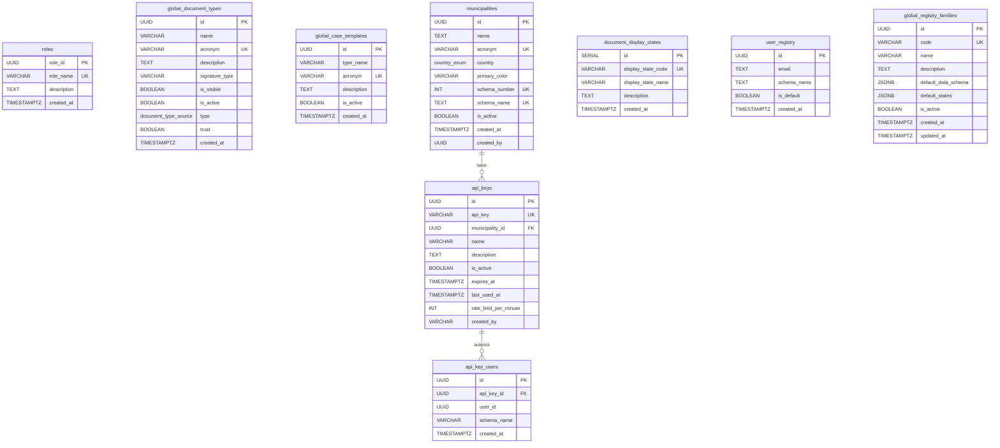

# Schema Public

El schema `public` contiene **9 tablas globales** compartidas por todos los municipios, mas tablas automaticas creadas por GDI-AgenteLANG.

## Diagrama ER

---

## TABLA 1: roles

Roles globales del sistema. Compartidos por todos los municipios.

| Columna | Tipo | Nullable | Default | Descripcion |
|---------|------|----------|---------|-------------|
| `role_id` | UUID | NO | `gen_random_uuid()` | Identificador unico |
| `role_name` | VARCHAR(50) | NO | - | Nombre del rol (unique) |
| `description` | TEXT | SI | - | Descripcion del rol |
| `created_at` | TIMESTAMPTZ | NO | `NOW()` | Fecha de creacion |

**Constraints:** PK `role_id`, UNIQUE `role_name`

**Datos seed (3 roles):**

| role_name | Descripcion |
|-----------|-------------|
| Usuario General | Usuario basico del sistema |
| Funcionario | Funcionario con permisos operativos |
| Administrador | Administrador con todos los permisos |

---

## TABLA 2: global_document_types

Catalogo maestro de tipos de documento. Cada municipio copia los que necesita a su tabla local `document_types`.

| Columna | Tipo | Nullable | Default | Descripcion |
|---------|------|----------|---------|-------------|
| `id` | UUID | NO | `gen_random_uuid()` | Identificador unico |
| `name` | VARCHAR(100) | NO | - | Nombre completo |
| `acronym` | VARCHAR(6) | NO | - | Acronimo (max 6 chars, unique) |
| `description` | TEXT | SI | - | Descripcion del tipo |
| `signature_type` | VARCHAR(50) | SI | `'required'` | Tipo de firma requerida |
| `is_visible` | BOOLEAN | NO | `true` | `false` para tipos internos (PV, CAEX) |
| `is_active` | BOOLEAN | NO | `true` | Si esta activo para uso |
| `type` | `document_type_source` | NO | `'HTML'` | Fuente: HTML, Importado, NOTA |
| `trust` | BOOLEAN | NO | `true` | `true` = documento gobierno, `false` = externo |
| `created_at` | TIMESTAMPTZ | NO | `NOW()` | Fecha de creacion |

**Constraints:** PK `id`, UNIQUE `acronym`, CHECK `char_length(acronym) <= 6`

**Datos seed:** 61 tipos (58 publicos + PV + CAEX internos). Ejemplos:

| Acronimo | Nombre | Tipo | Trust | Visible |
|----------|--------|------|-------|---------|
| IF | Informe | HTML | true | true |
| NOTA | Nota | NOTA | true | true |
| PROV | Providencia | HTML | true | true |
| IFGRA | Informe Grafico Importado | Importado | true | true |
| OFJUD | Oficio Judicial | Importado | false | true |
| PV | Pase | HTML | true | **false** |
| CAEX | Caratula | HTML | true | **false** |

!!! info "Tipos internos"
    PV (Pase) y CAEX (Caratula) tienen `is_visible = false` y `is_active = false`. Son de uso exclusivo del modulo de Expedientes Electronicos y se generan automaticamente.

---

## TABLA 3: global_case_templates

Catalogo maestro de plantillas de expediente. Cada municipio copia las que necesita.

| Columna | Tipo | Nullable | Default | Descripcion |
|---------|------|----------|---------|-------------|
| `id` | UUID | NO | `gen_random_uuid()` | Identificador unico |
| `type_name` | VARCHAR(100) | NO | - | Nombre de la plantilla |
| `acronym` | VARCHAR(6) | NO | - | Acronimo (unique) |
| `description` | TEXT | SI | - | Descripcion detallada |
| `is_active` | BOOLEAN | NO | `true` | Si esta activa |
| `created_at` | TIMESTAMPTZ | NO | `NOW()` | Fecha de creacion |

**Constraints:** PK `id`, UNIQUE `acronym`

**Datos seed:** 30 plantillas. Ejemplos:

| Acronimo | Nombre |
|----------|--------|
| EEVAR | Varios |
| LICPUB | Licitacion Publica |
| HABI | Habilitacion Comercial |
| COMP | Compras y Contrataciones |
| DEM | Demanda Judicial |
| RRHH | Recursos Humanos |
| OBPUB | Obra Publica |
| MAMBI | Medio Ambiente |

---

## TABLA 4: municipalities

Registro de municipios activos. Cada fila representa un tenant con su propio schema.

| Columna | Tipo | Nullable | Default | Descripcion |
|---------|------|----------|---------|-------------|
| `id` | UUID | NO | `gen_random_uuid()` | Identificador unico |
| `name` | TEXT | NO | - | Nombre completo del municipio |
| `acronym` | VARCHAR(4) | NO | - | Acronimo auto-generado (WXYZ) |
| `country` | `country_enum` | NO | - | Codigo de pais (AR, BR, UY...) |
| `primary_color` | VARCHAR(6) | NO | `'16158C'` | Color hex sin # |
| `schema_number` | INT | NO | - | Numero auto-incremental (100, 101...) |
| `schema_name` | TEXT | NO | - | Nombre del schema (ej: `100_test`) |
| `is_active` | BOOLEAN | NO | `true` | Si esta activo |
| `created_at` | TIMESTAMPTZ | NO | `NOW()` | Fecha de creacion |
| `created_by` | UUID | SI | - | Usuario que creo el registro |

**Constraints:** PK `id`, UNIQUE `acronym`, UNIQUE `schema_number`, UNIQUE `schema_name`

!!! note "Convencion de nombres"
    El `schema_name` sigue el formato `{schema_number}_{acronym_lower}`, por ejemplo: `100_test`, `101_bsas`. El acronimo se genera automaticamente con WXYZ y puede cambiar cuando el municipio formaliza el contrato.

---

## TABLA 5: document_display_states

Estados de visualizacion para el frontend. Mapeo de estados internos a nombres amigables.

| Columna | Tipo | Nullable | Default | Descripcion |
|---------|------|----------|---------|-------------|
| `id` | SERIAL | NO | auto | Identificador secuencial |
| `display_state_code` | VARCHAR(50) | NO | - | Codigo (unique) |
| `display_state_name` | VARCHAR(100) | NO | - | Nombre para mostrar |
| `description` | TEXT | SI | - | Descripcion |
| `created_at` | TIMESTAMPTZ | NO | `NOW()` | Fecha de creacion |

**Constraints:** PK `id`, UNIQUE `display_state_code`

**Datos seed (6 estados):**

| ID | Codigo | Nombre |
|----|--------|--------|
| 1 | DRAFT | Borrador |
| 2 | PENDING_SIGN | Pendiente de Firma |
| 3 | SIGNED | Firmado |
| 4 | REJECTED | Rechazado |
| 5 | CANCELLED | Cancelado |
| 6 | NUMBERED | Numerado |

---

## TABLA 6: user_registry

Mapeo multi-tenant: asocia un email a los schemas donde tiene acceso. Un usuario puede pertenecer a multiples municipios.

| Columna | Tipo | Nullable | Default | Descripcion |
|---------|------|----------|---------|-------------|
| `id` | UUID | NO | `gen_random_uuid()` | Identificador unico |
| `email` | TEXT | NO | - | Email del usuario |
| `schema_name` | TEXT | NO | - | Schema del municipio |
| `is_default` | BOOLEAN | NO | `false` | Municipio por defecto |
| `created_at` | TIMESTAMPTZ | NO | `NOW()` | Fecha de creacion |

**Constraints:** PK `id`, UNIQUE (`email`, `schema_name`)

**Indices:** `idx_user_registry_email` en `email`

!!! info "Sincronizacion automatica"
    Esta tabla se mantiene sincronizada automaticamente via trigger `fn_sync_user_registry` en cada schema de municipio. Cuando se crea, actualiza o elimina un usuario en `{schema}.users`, el trigger refleja el cambio en `public.user_registry`.

---

## TABLA 7: api_keys

API Keys para acceso REST a GDI-MCP Server. Cada municipio puede tener multiples API Keys.

| Columna | Tipo | Nullable | Default | Descripcion |
|---------|------|----------|---------|-------------|
| `id` | UUID | NO | `gen_random_uuid()` | Identificador unico |
| `api_key` | VARCHAR(64) | NO | - | Key unica (formato: `sk_live_xxx` o `sk_test_xxx`) |
| `municipality_id` | UUID | NO | - | FK a `municipalities` |
| `name` | VARCHAR(100) | NO | - | Nombre descriptivo del cliente |
| `description` | TEXT | SI | - | Descripcion de la integracion |
| `is_active` | BOOLEAN | NO | `true` | Si esta activa |
| `created_at` | TIMESTAMPTZ | NO | `NOW()` | Fecha de creacion |
| `expires_at` | TIMESTAMPTZ | SI | - | NULL = no expira |
| `last_used_at` | TIMESTAMPTZ | SI | - | Ultimo uso (se actualiza en cada request) |
| `rate_limit_per_minute` | INT | SI | `60` | Limite de requests/minuto |
| `created_by` | VARCHAR(100) | SI | - | Quien creo la key |

**Constraints:** PK `id`, UNIQUE `api_key`, FK `municipality_id` -> `municipalities(id)`

**Indices:**

- `idx_api_keys_key`: parcial en `api_key` WHERE `is_active = true`
- `idx_api_keys_municipality`: en `municipality_id`

---

## TABLA 8: api_key_users

Asocia usuarios a API Keys para trazabilidad. El cliente REST debe enviar `X-User-ID` en cada request.

| Columna | Tipo | Nullable | Default | Descripcion |
|---------|------|----------|---------|-------------|
| `id` | UUID | NO | `gen_random_uuid()` | Identificador unico |
| `api_key_id` | UUID | NO | - | FK a `api_keys` (CASCADE on delete) |
| `user_id` | UUID | NO | - | UUID del usuario en el schema del tenant |
| `schema_name` | VARCHAR(100) | NO | - | Schema donde existe el usuario |
| `created_at` | TIMESTAMPTZ | NO | `NOW()` | Fecha de creacion |

**Constraints:** PK `id`, UNIQUE (`api_key_id`, `user_id`, `schema_name`), FK `api_key_id` -> `api_keys(id)` ON DELETE CASCADE

**Indices:**

- `idx_api_key_users_key`: en `api_key_id`
- `idx_api_key_users_user`: en (`user_id`, `schema_name`)

---

## TABLA 9: global_registry_families

Familias de registros globales con esquema de datos y estados por defecto. Cada municipio puede copiar y personalizar estas familias.

| Columna | Tipo | Nullable | Default | Descripcion |
|---------|------|----------|---------|-------------|
| `id` | UUID | NO | `gen_random_uuid()` | Identificador unico |
| `code` | VARCHAR(10) | NO | - | Codigo unico (ej: ARQ, LUM, ORD) |
| `name` | VARCHAR(200) | NO | - | Nombre de la familia |
| `description` | TEXT | SI | - | Descripcion |
| `default_data_schema` | JSONB | SI | `'{}'` | Schema JSONB que define los campos del registro |
| `default_states` | JSONB | SI | `'["Activo","Inactivo","Suspendido","Archivado"]'` | Estados posibles |
| `is_active` | BOOLEAN | NO | `true` | Si esta activa |
| `created_at` | TIMESTAMPTZ | NO | `NOW()` | Fecha de creacion |
| `updated_at` | TIMESTAMPTZ | NO | `NOW()` | Ultima modificacion |

**Constraints:** PK `id`, UNIQUE `code`

**Datos seed (3 familias):**

| Codigo | Nombre | Estados |
|--------|--------|---------|
| ARQ | Registro de Arquitectura y Obras Particulares | Activo, En Inspeccion, Aprobado, Rechazado, Suspendido, Archivado |
| LUM | Registro de Luminarias y Alumbrado Publico | Activo, En Reparacion, Fuera de Servicio, Reemplazado, Archivado |
| ORD | Registro de Ordenanzas y Normativa | Vigente, Derogada, Modificada, En Revision, Archivada |

---

## Tablas Automaticas (LangGraph)

Las siguientes tablas son creadas automaticamente por **GDI-AgenteLANG** durante el startup. No deben crearse manualmente.

| Tabla | Proposito |
|-------|-----------|
| `checkpoints` | Estado del grafo LangGraph por thread_id |
| `checkpoint_blobs` | Datos binarios grandes (mensajes, estado) |
| `checkpoint_writes` | Escrituras pendientes (concurrencia) |
| `checkpoint_migrations` | Control de version del schema de checkpoints |
| `chat_messages` | Historial de chat relacional y consultable |

!!! warning "No crear manualmente"
    Estas tablas las administra LangGraph. El `thread_id` tiene formato `{municipality_id}:{conversation_id}` para aislamiento multi-tenant.
