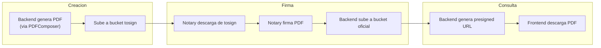

# Cloudflare R2

## Vision General

Cloudflare R2 es el servicio de almacenamiento de objetos de GDI Latam. Es compatible con la API S3 de AWS, lo que permite usar `boto3` (Python) para interactuar con el.

Se utiliza para almacenar:

- **PDFs oficiales** firmados (documentos finales)
- **PDFs pendientes de firma** (borradores enviados a firma)
- **Assets** del sistema (logos, isologos de municipios)

---

## Buckets

| Bucket | Proposito | Acceso |
|--------|-----------|--------|
| `tenant-<id>-oficial` | PDFs firmados y oficiales | GDI-Backend (lectura/escritura) |
| `tenant-<id>-tosign` | PDFs pendientes de firma (temporales) | GDI-Backend (lectura/escritura) |
| `gdi-assets` | Logos e imagenes de municipios | GDI-BackOffice-Back (escritura), Frontends (lectura) |

!!! info "Convenciones de naming"
    Los nombres de bucket siguen el patron `tenant-<schema_name>-<tipo>`. Ejemplo: para el schema `100_test`, los buckets son `tenant-test-oficial` y `tenant-test-tosign`.

---

## Credenciales

Las credenciales de R2 se almacenan como variables de entorno en Railway. Nunca en codigo fuente.

| Variable | Descripcion | Donde se usa |
|----------|-------------|--------------|
| `CF_R2_ENDPOINT` | Endpoint S3-compatible | GDI-Backend |
| `CF_R2_ACCESS_KEY_ID` | Access Key ID | GDI-Backend |
| `CF_R2_SECRET_ACCESS_KEY` | Secret Access Key | GDI-Backend |
| `CF_R2_BUCKET_OFICIAL` | Nombre del bucket oficial | GDI-Backend |
| `CF_R2_BUCKET_TOSIGN` | Nombre del bucket tosign | GDI-Backend |
| `CF_R2_SIGN_EXPIRATION` | Expiracion de presigned URLs (segundos) | GDI-Backend |

**Formato del endpoint:**

```
https://<ACCOUNT_ID>.r2.cloudflarestorage.com
```

!!! danger "Seguridad"
    Las credenciales R2 solo deben estar en variables de entorno de Railway. Nunca commitear credenciales al repositorio.

---

## Acceso via S3 API (boto3)

GDI-Backend usa `boto3` para interactuar con R2. La configuracion del cliente es:

```python
import boto3

r2_client = boto3.client(
    "s3",
    endpoint_url=os.getenv("CF_R2_ENDPOINT"),
    aws_access_key_id=os.getenv("CF_R2_ACCESS_KEY_ID"),
    aws_secret_access_key=os.getenv("CF_R2_SECRET_ACCESS_KEY"),
    region_name="auto",  # R2 no usa regiones, pero boto3 lo requiere
)
```

### Operaciones Principales

**Subir un PDF:**

```python
r2_client.put_object(
    Bucket="tenant-test-oficial",
    Key="100_test/official/2025/01/IF-2025-0001234-MUNI.pdf",
    Body=pdf_bytes,
    ContentType="application/pdf",
)
```

**Generar URL firmada (presigned) para descarga:**

```python
url = r2_client.generate_presigned_url(
    "get_object",
    Params={
        "Bucket": "tenant-test-oficial",
        "Key": "100_test/official/2025/01/IF-2025-0001234-MUNI.pdf",
    },
    ExpiresIn=600,  # 10 minutos
)
```

**Descargar un PDF:**

```python
response = r2_client.get_object(
    Bucket="tenant-test-tosign",
    Key="100_test/tosign/draft-uuid.pdf",
)
pdf_bytes = response["Body"].read()
```

**Eliminar un objeto:**

```python
r2_client.delete_object(
    Bucket="tenant-test-tosign",
    Key="100_test/tosign/draft-uuid.pdf",
)
```

---

## Estructura de Keys (Paths)

Los objetos en R2 se organizan con la siguiente estructura de keys:

### Bucket Oficial (`tenant-*-oficial`)

```
<schema_name>/official/<year>/<month>/<document_number>.pdf
```

Ejemplos:

```
100_test/official/2025/01/IF-2025-0001234-MUNI.pdf
100_test/official/2025/01/DICT-2025-0000089-MUNI.pdf
100_test/official/2025/02/RES-2025-0000001-MUNI.pdf
```

### Bucket ToSign (`tenant-*-tosign`)

```
<schema_name>/tosign/<document_draft_uuid>.pdf
```

Ejemplos:

```
100_test/tosign/a1b2c3d4-e5f6-7890-abcd-ef1234567890.pdf
100_test/tosign/f9e8d7c6-b5a4-3210-fedc-ba0987654321.pdf
```

### Bucket Assets (`gdi-assets`)

```
<schema_name>/logos/<filename>
<schema_name>/isologos/<filename>
```

Ejemplos:

```
100_test/logos/municipalidad-logo.png
100_test/isologos/municipalidad-isologo.png
```

---

## Flujo de Documentos



1. **Creacion**: El Backend genera un PDF via PDFComposer y lo sube al bucket `tosign`
2. **Firma**: Cuando se inicia el proceso de firma, el Backend descarga de `tosign`, envia a Notary para firmar, y sube el resultado a `oficial`
3. **Consulta**: El Frontend solicita un PDF al Backend, que genera una presigned URL temporal para la descarga directa desde R2

---

## Multi-Tenant

Cada municipio (tenant) tiene sus propios buckets con un prefijo de schema en las keys:

```
# Tenant 100_test
tenant-test-oficial/100_test/official/...
tenant-test-tosign/100_test/tosign/...

# Tenant 200_municipio
tenant-municipio-oficial/200_municipio/official/...
tenant-municipio-tosign/200_municipio/tosign/...
```

El codigo en `services/storage/cloudflare.py` obtiene el cliente R2 correcto usando:

```python
r2_client = get_tenant_r2_client(schema_name=schema_name)
```

!!! warning "Aislamiento de datos"
    El `schema_name` se usa como prefijo en las keys de R2 para asegurar que un tenant no pueda acceder a los archivos de otro. Este patron es consistente con el multi-tenant de la base de datos.

---

## CORS

Para que los frontends puedan descargar PDFs directamente desde R2 (via presigned URLs), se requiere configurar CORS en los buckets.

**Configuracion de CORS recomendada (via Cloudflare Dashboard):**

```json
[
  {
    "AllowedOrigins": [
      "https://gdi-frontend-*.up.railway.app",
      "https://gdi-backoffice-front-*.up.railway.app",
      "http://localhost:3003",
      "http://localhost:3013"
    ],
    "AllowedMethods": ["GET", "HEAD"],
    "AllowedHeaders": ["*"],
    "MaxAgeSeconds": 3600
  }
]
```

!!! tip "Presigned URLs"
    En la practica, GDI usa presigned URLs para la mayoria de descargas. Las presigned URLs no requieren CORS porque la autenticacion esta embebida en la URL misma. CORS solo es necesario si se hacen requests directos desde el navegador con headers de autenticacion.

---

## Monitoreo

### Verificar Conectividad

Desde el Backend, se puede verificar la conexion a R2 listando los buckets:

```python
response = r2_client.list_buckets()
for bucket in response["Buckets"]:
    print(bucket["Name"])
```

### Verificar Objetos

```bash
# Via AWS CLI (compatible con R2)
aws s3 ls s3://tenant-test-oficial/ \
  --endpoint-url https://<ACCOUNT_ID>.r2.cloudflarestorage.com \
  --profile r2
```

---

## Limites

| Limite | Valor |
|--------|-------|
| Tamano maximo de objeto | 5 GB (multipart upload) |
| Tamano maximo de upload simple | 100 MB |
| Operaciones Class A (escritura) | Gratis primeras 1M/mes |
| Operaciones Class B (lectura) | Gratis primeras 10M/mes |
| Storage | Gratis primeros 10 GB/mes |
| Egress | Gratis (sin cargos de salida) |

!!! tip "Costos"
    Cloudflare R2 no cobra por egress (trafico de salida), lo que lo hace significativamente mas economico que AWS S3 para servir PDFs a usuarios finales.
