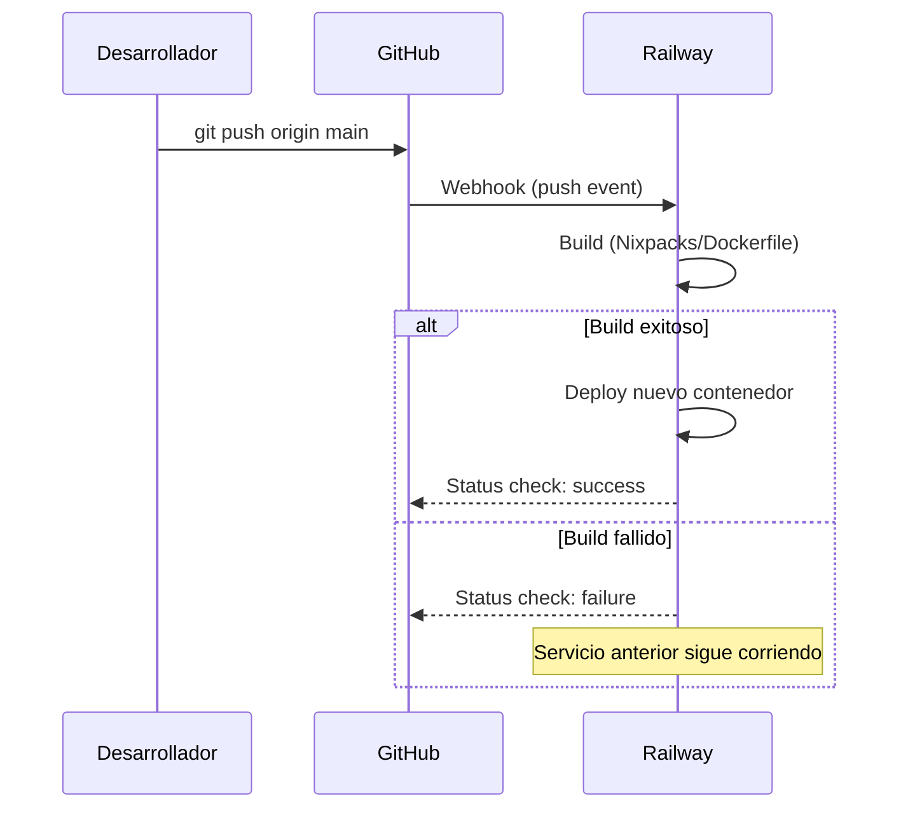
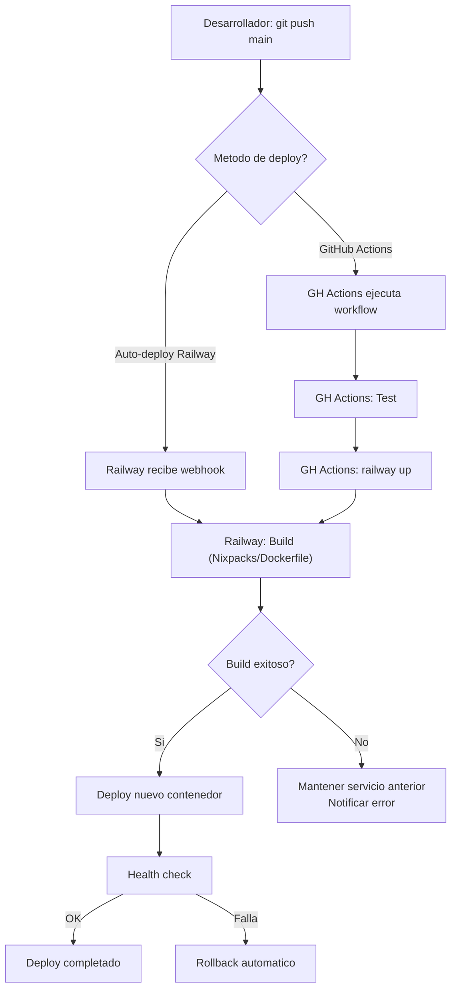

# GitHub Actions

## Vision General

GDI Latam usa GitHub como plataforma de repositorios bajo la organizacion **GDI-ALFA**. El deploy a Railway se realiza de dos formas:

1. **Auto-deploy via Railway** (principal): Railway se conecta directamente al repo de GitHub y despliega automaticamente al detectar un push a `main`
2. **GitHub Actions** (complementario): Workflows manuales o automatizados para deploy, testing y CI/CD

!!! info "Deploy principal"
    La mayoria de servicios usan el auto-deploy nativo de Railway (sin GitHub Actions). Railway detecta pushes a `main` y redespliega automaticamente. GitHub Actions se usa como alternativa para control adicional o para repos que necesitan pasos extra.

---

## Repositorios

Cada servicio es un repositorio independiente en la organizacion GitHub:

| Repositorio | Servicio Railway | Stack |
|-------------|-----------------|-------|
| GDI-FRONTEND | GDI-FRONTEND | Next.js 15 |
| GDI-Backend | GDI-Backend | FastAPI |
| GDI-BackOffice-Front | GDI-BackOffice-Front | Next.js 15 |
| GDI-BackOffice-Back | GDI-BackOffice-Back | FastAPI |
| GDI-PDFComposer | GDI-PDFComposer | FastAPI + Gotenberg |
| GDI-Notary | GDI-Notary | FastAPI + pyHanko |
| GDI-eMailService | GDI-eMailService | FastAPI |
| GDI-AgenteLANG | GDI-AgenteLANG | FastAPI + LangGraph |
| GDI-BD | -- | Scripts SQL, migraciones |

---

## Auto-Deploy con Railway

### Como Funciona

Railway tiene integracion nativa con GitHub. Al vincular un repositorio:

1. Desarrollador hace `git push origin main`
2. Railway recibe webhook de GitHub
3. Railway inicia build automatico (Nixpacks o Dockerfile)
4. Si el build es exitoso, reemplaza el servicio en ejecucion
5. Si el build falla, el servicio anterior sigue corriendo



### Configuracion

La configuracion del auto-deploy se realiza en el Dashboard de Railway:

1. Ir al servicio
2. Tab **Settings**
3. Seccion **Source**
4. Vincular repositorio GitHub
5. Seleccionar rama (`main`)
6. Configurar Root Directory si aplica

---

## Workflow de GitHub Actions para Railway

Para servicios que necesitan un workflow de CI/CD personalizado:

### Estructura del Workflow

```yaml
# .github/workflows/deploy.yml
name: Deploy to Railway

on:
  push:
    branches: [main]

jobs:
  deploy:
    runs-on: ubuntu-latest
    steps:
      - uses: actions/checkout@v4

      - name: Install Railway CLI
        run: npm i -g @railway/cli

      - name: Deploy to Railway
        env:
          RAILWAY_TOKEN: ${{ secrets.RAILWAY_TOKEN }}
        run: |
          railway link ${{ secrets.RAILWAY_PROJECT_ID }}
          railway up --service ${{ vars.RAILWAY_SERVICE_NAME }} --detach
```

### Workflow con Build y Test

Para repos que necesitan testing antes del deploy:

```yaml
# .github/workflows/ci-deploy.yml
name: CI + Deploy

on:
  push:
    branches: [main]
  pull_request:
    branches: [main]

jobs:
  test:
    runs-on: ubuntu-latest
    steps:
      - uses: actions/checkout@v4

      - name: Set up Python
        uses: actions/setup-python@v5
        with:
          python-version: "3.12"

      - name: Install dependencies
        run: pip install -r requirements.txt

      - name: Run tests
        run: pytest tests/ -v

  deploy:
    needs: test
    if: github.ref == 'refs/heads/main'
    runs-on: ubuntu-latest
    steps:
      - uses: actions/checkout@v4

      - name: Install Railway CLI
        run: npm i -g @railway/cli

      - name: Deploy to Railway
        env:
          RAILWAY_TOKEN: ${{ secrets.RAILWAY_TOKEN }}
        run: |
          railway link ${{ secrets.RAILWAY_PROJECT_ID }}
          railway up --service ${{ vars.RAILWAY_SERVICE_NAME }} --detach
```

---

## GitHub Secrets

Los siguientes secrets deben configurarse en cada repositorio (o a nivel de organizacion):

| Secret | Descripcion | Donde obtener |
|--------|-------------|---------------|
| `RAILWAY_TOKEN` | Token de autenticacion Railway | `railway login --browserless` |
| `RAILWAY_PROJECT_ID` | ID del proyecto Railway | Dashboard Railway o `railway status` |

### Configurar Secrets

**A nivel de repositorio:**

1. Ir al repositorio en GitHub
2. **Settings** > **Secrets and variables** > **Actions**
3. Click **New repository secret**
4. Agregar `RAILWAY_TOKEN` y `RAILWAY_PROJECT_ID`

**A nivel de organizacion (recomendado):**

1. Ir a la organizacion GDI-ALFA
2. **Settings** > **Secrets and variables** > **Actions**
3. Agregar secrets compartidos
4. Seleccionar repositorios que pueden acceder

### Variables (no sensibles)

Para valores que no son secretos, usar **Variables** en lugar de Secrets:

| Variable | Descripcion | Ejemplo |
|----------|-------------|---------|
| `RAILWAY_SERVICE_NAME` | Nombre del servicio a desplegar | `gdi-backend` |

---

## Generar Railway Token

```bash
# Opcion 1: Via CLI (genera token para CI)
railway login --browserless
# Copiar el token generado

# Opcion 2: Via Dashboard
# railway.app > Account Settings > Tokens > Create Token
```

!!! warning "Permisos del token"
    El token de Railway tiene acceso completo al proyecto. Rotarlo periodicamente y nunca compartirlo fuera de GitHub Secrets.

---

## Deploy por Servicio

### Servicios con Procfile (Python)

Los servicios que usan `Procfile` son detectados automaticamente por Nixpacks:

| Servicio | Procfile |
|----------|----------|
| GDI-Backend | `web: gunicorn main:app --workers 8 --worker-class uvicorn.workers.UvicornWorker --bind 0.0.0.0:$PORT --timeout 120 ...` |
| GDI-eMailService | `web: uvicorn main:app --host 0.0.0.0 --port $PORT` |

Railway lee el `Procfile`, detecta Python como lenguaje, instala dependencias de `requirements.txt` y ejecuta el comando `web:`.

### Servicios con Dockerfile

Los servicios con `Dockerfile` son construidos directamente como imagen Docker:

| Servicio | Base Image | Build especial |
|----------|-----------|----------------|
| GDI-PDFComposer | `python:3.11-slim` | Usuario non-root, gunicorn config |
| GDI-Notary | `python:3.11-slim` | Dependencias sistema (wget, fontconfig), fuentes Montserrat, certificados |
| GDI-AgenteLANG | `python:3.11-slim` | Dependencias sistema (gcc, libpq-dev) |

### Servicios Next.js (Node)

Railway detecta automaticamente Next.js y ejecuta:

```bash
npm install
npm run build
npm start
```

No necesitan `Procfile` ni `Dockerfile`.

---

## Flujo Completo de un Deployment



---

## Buenas Practicas

### Branching

```bash
# Crear rama de feature
git checkout -b feat/nueva-funcionalidad

# Desarrollar y commitear
git add .
git commit -m "feat(backend): add new endpoint for X"

# Push a feature branch (NO despliega)
git push origin feat/nueva-funcionalidad

# Crear Pull Request en GitHub
# Review + merge a main = Deploy automatico
```

!!! tip "Proteccion de rama main"
    Se recomienda configurar proteccion de rama en `main` para requerir Pull Request con al menos 1 review antes de merge. Esto evita deployments accidentales.

### Commits

Seguir el formato convencional por repositorio:

```bash
# Formato
<tipo>(<scope>): <descripcion>

# Ejemplos
feat(backend): add document import endpoint
fix(frontend): resolve PDF viewer hydration error
refactor(notary): extract certificate loading logic
docs(deploy): update Railway configuration guide
```

### Pre-deploy Checklist

- [ ] Tests pasando localmente
- [ ] Variables de entorno actualizadas en Railway
- [ ] Health check del servicio funciona
- [ ] Sin credenciales hardcodeadas en el codigo
- [ ] PR revisado y aprobado
- [ ] Base de datos migrada si hay cambios de schema

### Post-deploy Checklist

- [ ] Logs sin errores criticos (`railway logs --follow`)
- [ ] Health check respondiendo 200
- [ ] Funcionalidad principal testeada
- [ ] Servicios dependientes funcionando
