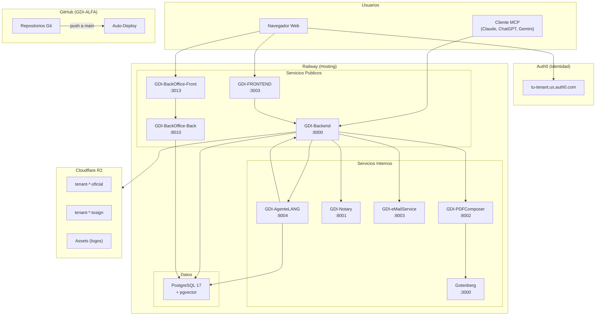

# Infraestructura

## Vision General

GDI Latam opera sobre una arquitectura cloud distribuida en cuatro plataformas principales:

| Plataforma | Rol | Servicios |
|------------|-----|-----------|
| **Railway** | Hosting de aplicaciones y base de datos | 10+ servicios (backends, frontends, microservicios, PostgreSQL) |
| **Cloudflare R2** | Almacenamiento de objetos (S3-compatible) | Buckets para PDFs oficiales, PDFs pendientes de firma, assets |
| **Auth0** | Identidad y autenticacion | OAuth 2.0, JWT, SSO para todas las aplicaciones |
| **GitHub** | Repositorios y CI/CD | Organizacion GDI-ALFA, deploy automatico via Railway |

---

## Diagrama de Infraestructura



---

## Servicios Desplegados

### Servicios Publicos (con URL externa)

| Servicio | Stack | Puerto | Proposito |
|----------|-------|--------|-----------|
| GDI-FRONTEND | Next.js 15, React 18, TypeScript | 3003 | Portal ciudadano y funcionarios |
| GDI-Backend | FastAPI, Python 3.12, Gunicorn | 8000 | API REST principal + MCP Server |
| GDI-BackOffice-Front | Next.js 15, React 18, TypeScript | 3013 | Panel de administracion |
| GDI-BackOffice-Back | FastAPI, Python 3.12, psycopg2 | 8010 | API REST BackOffice |

### Servicios Internos (solo accesibles via Railway internal)

| Servicio | Stack | Puerto | Proposito |
|----------|-------|--------|-----------|
| GDI-PDFComposer | FastAPI, Jinja2, Gotenberg | 8002 | Generacion de PDFs (preview, final, caratulas, pases) |
| GDI-Notary | FastAPI, pyHanko, PyMuPDF | 8001 | Firma digital PAdES y visual de PDFs |
| GDI-eMailService | FastAPI, Jinja2, SMTP | 8003 | Emails transaccionales |
| GDI-AgenteLANG | FastAPI, LangGraph, pgvector | 8004 | Agente IA con RAG |
| Gotenberg | Chromium headless | 3000 | Motor de conversion HTML a PDF |

### Base de Datos

| Servicio | Version | Tipo | Proposito |
|----------|---------|------|-----------|
| PostgreSQL | 17+ | Railway Managed | BD principal con pgvector para embeddings |

---

## Ambientes

| Ambiente | Nombre Railway | Uso | Estado |
|----------|---------------|-----|--------|
| **dev** | prod-railway | Demo online para stakeholders | NO TOCAR |
| **dev-test** | dev-railway | Desarrollo y pruebas | Uso activo |

!!! danger "Regla critica"
    El ambiente **dev (prod-railway)** es la demo en vivo. Nunca modificar datos ni hacer deployments experimentales en este ambiente.

!!! tip "Desarrollo"
    Siempre usar el ambiente **dev-test (dev-railway)** para desarrollo y pruebas.
    Connection string: `postgresql://postgres:<PASSWORD>@dev-host.proxy.rlwy.net:5432/railway`

---

## Flujo de Comunicacion

### Comunicacion Externa (URLs publicas)

Los frontends y clientes MCP se comunican con los backends a traves de URLs publicas Railway (`*.up.railway.app`):

```
Browser → https://mi-frontend.up.railway.app → https://mi-backend.up.railway.app
```

### Comunicacion Interna (URLs internas Railway)

Los backends se comunican con los microservicios a traves de URLs internas Railway, que son mas rapidas y sin costo de egress:

```
GDI-Backend → http://pdfcomposer-svc.railway.internal:8002
GDI-Backend → http://notary-svc.railway.internal:8001
GDI-Backend → http://email-svc.railway.internal:8003
GDI-Backend → http://agente-svc.railway.internal:8004
PDFComposer → http://gotenberg.railway.internal:3000
```

!!! warning "Internal URLs"
    Las URLs internas (`*.railway.internal`) solo funcionan entre servicios del mismo proyecto Railway. No son accesibles desde internet ni desde maquinas locales.

---

## Seguridad

### Autenticacion

| Capa | Mecanismo | Proveedor |
|------|-----------|-----------|
| Usuarios finales | OAuth 2.0 + JWT | Auth0 |
| Comunicacion entre servicios | API Key (`X-API-Key` header) | Configurado en variables Railway |
| MCP Server | OAuth 2.0 (RFC 9728) | Auth0 |
| REST API externa | API Key + `X-User-ID` | Almacenado en BD |

### Variables Sensibles

Todas las credenciales se almacenan como variables de entorno en Railway. Nunca en codigo fuente.

| Tipo | Ejemplos |
|------|----------|
| Base de datos | `DATABASE_URL`, `DB_HOST`, `DB_PASSWORD` |
| Auth0 | `AUTH0_DOMAIN`, `AUTH0_CLIENT_SECRET` |
| Cloudflare R2 | `CF_R2_ACCESS_KEY_ID`, `CF_R2_SECRET_ACCESS_KEY` |
| API Keys internas | `PDFCOMPOSER_API_KEY`, `NOTARY_API_KEY` |

---

## Secciones de esta Guia

| Seccion | Contenido |
|---------|-----------|
| [Railway](railway.md) | Proyecto, servicios, ambientes, variables, internal URLs |
| [Cloudflare R2](cloudflare-r2.md) | Buckets, credenciales, API S3, estructura de keys |
| [GitHub Actions](github-actions.md) | Workflows CI/CD, secrets, deploy automatico |
