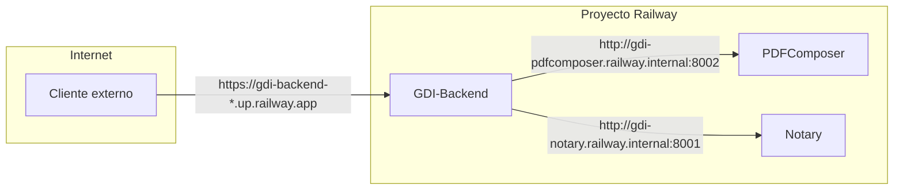

# Railway

## Proyecto

| Campo | Valor |
|-------|-------|
| **Team** | GDI |
| **Project** | GDI_v0 |
| **Project ID** | `0455edb5-2fc1-44c8-8e36-991d95c53ff9` |
| **Region** | US West |

---

## Ambientes

Railway soporta multiples ambientes dentro del mismo proyecto. GDI tiene dos:

| Ambiente | Nombre Interno | Host BD | Uso |
|----------|---------------|---------|-----|
| **dev** | prod-railway | `prod-host.proxy.rlwy.net` | Demo en vivo -- NO TOCAR |
| **dev-test** | dev-railway | `dev-host.proxy.rlwy.net:5432` | Desarrollo y pruebas |

!!! danger "Ambiente de demo"
    El ambiente **dev (prod-railway)** es la demo para stakeholders. No hacer cambios de variables, deployments experimentales ni migraciones de BD en este ambiente.

```bash
# Cambiar entre ambientes via CLI
railway environment use dev
railway environment use dev-test
```

---

## Servicios

### GDI-Backend (API Principal)

| Campo | Valor |
|-------|-------|
| **Stack** | Python 3.12, FastAPI, Gunicorn + Uvicorn |
| **Puerto** | 8000 |
| **Tipo** | Publico (URL externa) |
| **Root Directory** | `Backend/` |
| **Start Command** | `gunicorn main:app --workers 8 --worker-class uvicorn.workers.UvicornWorker --bind 0.0.0.0:$PORT --timeout 120 --keep-alive 5 --max-requests 1000 --max-requests-jitter 50 --preload` |

**Variables de entorno:**

| Variable | Descripcion | Ejemplo |
|----------|-------------|---------|
| `DB_HOST` | Host PostgreSQL | `prod-host.proxy.rlwy.net` |
| `DB_PORT` | Puerto PostgreSQL | `33832` |
| `DB_USER` | Usuario BD | `postgres` |
| `DB_PASSWORD` | Password BD | `<RAILWAY_SECRET>` |
| `DB_NAME` | Nombre de la base de datos | `GDI-MVP` |
| `TESTING_MODE` | Modo testing (header X-User-ID) | `true` / `false` |
| `AUTH0_DOMAIN` | Dominio Auth0 | `tu-tenant.us.auth0.com` |
| `AUTH0_AUDIENCE` | Audience JWT | `https://api.gdilatam.com` |
| `PDFCOMPOSER_URL` | URL PDFComposer (internal) | `http://gdi-pdfcomposer.railway.internal:8002` |
| `PDFCOMPOSER_API_KEY` | API Key PDFComposer | `<SECRET>` |
| `NOTARY_URL` | URL Notary (internal) | `http://gdi-notary.railway.internal:8001` |
| `NOTARY_API_KEY` | API Key Notary | `<SECRET>` |
| `EMAILSERVICE_URL` | URL eMailService (internal) | `http://gdi-emailservice.railway.internal:8003` |
| `CF_R2_ENDPOINT` | Endpoint Cloudflare R2 | `https://<ACCOUNT_ID>.r2.cloudflarestorage.com` |
| `CF_R2_ACCESS_KEY_ID` | R2 Access Key | `<SECRET>` |
| `CF_R2_SECRET_ACCESS_KEY` | R2 Secret Key | `<SECRET>` |
| `CF_R2_BUCKET_OFICIAL` | Bucket PDFs oficiales | `tenant-test-oficial` |
| `CF_R2_BUCKET_TOSIGN` | Bucket PDFs pendientes | `tenant-test-tosign` |
| `CF_R2_SIGN_EXPIRATION` | Expiracion URLs firmadas (seg) | `600` |

**Health check:**

```bash
curl https://<BACKEND_URL>/health
# {"status": "healthy", "database": "connected"}
```

---

### GDI-FRONTEND (Portal Principal)

| Campo | Valor |
|-------|-------|
| **Stack** | Next.js 15, React 18, TypeScript 5, Tailwind |
| **Puerto** | 3003 |
| **Tipo** | Publico (URL externa) |

**Variables de entorno:**

| Variable | Descripcion |
|----------|-------------|
| `AUTH0_SECRET` | Secret para sesiones |
| `AUTH0_BASE_URL` | URL base de la app |
| `AUTH0_ISSUER_BASE_URL` | URL Auth0 |
| `AUTH0_CLIENT_ID` | Client ID Auth0 |
| `AUTH0_CLIENT_SECRET` | Client Secret Auth0 |
| `NEXT_PUBLIC_API_URL` | URL del Backend API |

---

### GDI-BackOffice-Front (Panel Admin)

| Campo | Valor |
|-------|-------|
| **Stack** | Next.js 15, React 18, TypeScript 5, Tailwind |
| **Puerto** | 3013 |
| **Tipo** | Publico (URL externa) |

**Variables de entorno:** Identicas a GDI-FRONTEND pero apuntando al BackOffice-Back.

---

### GDI-BackOffice-Back (API Admin)

| Campo | Valor |
|-------|-------|
| **Stack** | Python 3.12, FastAPI, psycopg2 |
| **Puerto** | 8010 |
| **Tipo** | Publico (URL externa) |

**Variables de entorno:**

| Variable | Descripcion |
|----------|-------------|
| `DB_HOST` | Host PostgreSQL |
| `DB_PORT` | Puerto PostgreSQL |
| `DB_USER` | Usuario BD |
| `DB_PASSWORD` | Password BD |
| `DB_NAME` | Nombre de la base de datos |
| `AUTH0_DOMAIN` | Dominio Auth0 |
| `AUTH0_AUDIENCE` | Audience JWT |
| `FRONTEND_URL` | URL del BackOffice-Front (CORS) |
| `TESTING_MODE` | Modo testing |

---

### GDI-PDFComposer (Generador de PDFs)

| Campo | Valor |
|-------|-------|
| **Stack** | Python 3.11, FastAPI, Jinja2, Gunicorn |
| **Puerto** | 8002 |
| **Tipo** | Interno (`*.railway.internal`) |
| **Dockerfile** | Si |
| **Start Command** | `gunicorn main:app -c gunicorn_conf.py` |

**Variables de entorno:**

| Variable | Descripcion |
|----------|-------------|
| `API_KEY` | API Key para autenticacion |
| `GOTENBERG_URL` | URL Gotenberg (internal) |
| `GUNICORN_WORKERS` | Numero de workers (default 4) |

**Health check:**

```bash
# Solo desde dentro de Railway (internal)
curl http://gdi-pdfcomposer.railway.internal:8002/health
```

---

### GDI-Notary (Firma Digital)

| Campo | Valor |
|-------|-------|
| **Stack** | Python 3.11, FastAPI, pyHanko, PyMuPDF, ReportLab |
| **Puerto** | 8001 |
| **Tipo** | Interno (`*.railway.internal`) |
| **Dockerfile** | Si |
| **Start Command** | `gunicorn app.main:app -c gunicorn_conf.py` |

**Variables de entorno:**

| Variable | Descripcion |
|----------|-------------|
| `API_KEY` | API Key para autenticacion |
| `ENVIRONMENT` | `test` o `prd` |
| `CERTS_DIR` | Directorio de certificados (default `./certs`) |
| `TSA_URL` | Servidor de timestamp (default `http://timestamp.digicert.com`) |
| `FALLBACK_TO_VISUAL` | Fallback a firma visual si no hay certificado |
| `GUNICORN_WORKERS` | Numero de workers (default 3) |
| `GUNICORN_TIMEOUT` | Timeout en segundos (default 90) |

**Health check:**

```bash
curl http://gdi-notary.railway.internal:8001/health
# {"status": "healthy", "signature_system": "pades", ...}
```

---

### GDI-eMailService (Emails)

| Campo | Valor |
|-------|-------|
| **Stack** | Python 3.11+, FastAPI, Jinja2 |
| **Puerto** | 8003 |
| **Tipo** | Interno (`*.railway.internal`) |
| **Start Command** | `uvicorn main:app --host 0.0.0.0 --port $PORT` |

**Variables de entorno:**

| Variable | Descripcion |
|----------|-------------|
| `API_KEY` | API Key para autenticacion |
| `SMTP_HOST` | Host SMTP |
| `SMTP_PORT` | Puerto SMTP (587 TLS) |
| `SMTP_USER` | Usuario SMTP |
| `SMTP_PASSWORD` | Password SMTP |
| `FROM_EMAIL` | Email de origen |
| `FROM_NAME` | Nombre de origen |

---

### GDI-AgenteLANG (Agente IA)

| Campo | Valor |
|-------|-------|
| **Stack** | Python 3.11, FastAPI, LangGraph, pgvector |
| **Puerto** | 8004 |
| **Tipo** | Interno (`*.railway.internal`) |
| **Dockerfile** | Si |
| **Start Command** | `uvicorn app.main:app --host 0.0.0.0 --port ${PORT:-8004}` |

**Variables de entorno:**

| Variable | Descripcion |
|----------|-------------|
| `OPENROUTER_API_KEY` | API Key OpenRouter |
| `OPENROUTER_MODEL` | Modelo principal (Gemini Flash 2.0) |
| `OPENROUTER_FAST_MODEL` | Modelo router (Llama 3.3 free) |
| `EMBEDDINGS_MODEL` | Modelo embeddings |
| `GDI_BACKEND_URL` | URL Backend (para tools) |
| `INTERNAL_API_KEY` | API Key interna |
| `DATABASE_URL` | PostgreSQL connection string |
| `AUTH0_DOMAIN` | Dominio Auth0 |
| `AUTH0_AUDIENCE` | Audience JWT |
| `AI_WORKER_INTERVAL` | Intervalo polling worker (seg) |
| `AI_WORKER_BATCH_SIZE` | Docs por batch |
| `ENABLED_SCHEMAS` | Schemas a procesar (JSON array) |

---

### Gotenberg (Motor PDF)

| Campo | Valor |
|-------|-------|
| **Stack** | Go, Chromium headless |
| **Puerto** | 3000 |
| **Tipo** | Interno (`*.railway.internal`) |
| **Imagen** | Railway managed |

No requiere variables de entorno personalizadas.

---

### PostgreSQL

| Campo | Valor |
|-------|-------|
| **Version** | 17+ con pgvector |
| **Tipo** | Railway Managed |
| **Puerto interno** | 5432 |
| **Puerto proxy (dev)** | 33832 |
| **Puerto proxy (dev-test)** | 5432 |

---

## Internal URLs vs Public URLs

Railway permite comunicacion entre servicios del mismo proyecto sin pasar por internet:



### Formato de Internal URLs

```
http://<service-name>.railway.internal:<port>
```

| Servicio | Internal URL |
|----------|-------------|
| GDI-PDFComposer | `http://gdi-pdfcomposer.railway.internal:8002` |
| GDI-Notary | `http://gdi-notary.railway.internal:8001` |
| GDI-eMailService | `http://gdi-emailservice.railway.internal:8003` |
| GDI-AgenteLANG | `http://gdi-agentelang.railway.internal:8004` |
| Gotenberg | `http://gotenberg.railway.internal:3000` |
| PostgreSQL | `postgres.railway.internal:5432` |

!!! tip "Ventajas de Internal URLs"
    - Sin latencia de internet (comunicacion directa dentro del cluster)
    - Sin costo de egress
    - No exponen servicios internos a internet

!!! warning "Limitaciones"
    - Solo funcionan entre servicios del mismo proyecto Railway
    - No accesibles desde maquinas locales (usar public URLs para desarrollo)
    - Protocolo `http://` (no https) porque el trafico es interno

---

## Railway CLI

### Instalacion

```bash
npm i -g @railway/cli
```

### Autenticacion

```bash
railway login
# Abre navegador para autenticar

railway login --browserless
# Genera token para CI/CD (sin navegador)
```

### Comandos Frecuentes

```bash
# Vincular directorio local a proyecto Railway
railway link

# Seleccionar servicio activo
railway service

# Ver variables de entorno del servicio
railway variables

# Configurar variable
railway variables --set KEY="value"

# Deploy directo
railway up --detach

# Ver logs en tiempo real
railway logs --follow

# Ver logs de build
railway logs --build

# Cambiar ambiente
railway environment use dev-test

# Redeploy sin cambios de codigo
railway redeploy

# Ver dominio publico
railway domain

# SSH al contenedor
railway ssh

# Ejecutar comando con variables de Railway
railway run python main.py
```

---

## Health Check Endpoints

Cada servicio expone un endpoint `/health` que no requiere autenticacion:

| Servicio | Endpoint | Respuesta esperada |
|----------|----------|--------------------|
| GDI-Backend | `GET /health` | `{"status": "healthy", "database": "connected"}` |
| GDI-BackOffice-Back | `GET /health` | `{"status": "ok"}` |
| GDI-PDFComposer | `GET /health` | `{"status": "ok"}` |
| GDI-Notary | `GET /health` | `{"status": "healthy", "signature_system": "pades"}` |
| GDI-eMailService | `GET /health` | `{"status": "ok"}` |
| GDI-AgenteLANG | `GET /health` | `{"status": "ok", "database": "ok", "ai_worker": "running"}` |
| GDI-AgenteLANG | `GET /health/detailed` | Health detallado con stats del worker |

---

## Deployment

### Auto-Deploy (Recomendado)

Railway detecta automaticamente los pushes a la rama principal de cada repositorio y despliega el servicio:

```bash
git add .
git commit -m "feat: nueva funcionalidad"
git push origin main
# Railway inicia build + deploy automaticamente
```

### Deploy Manual via CLI

```bash
# Desde el directorio del servicio
railway link
railway service  # Seleccionar servicio
railway up --detach
```

### Verificacion Post-Deploy

```bash
# Ver logs
railway logs --follow

# Verificar health
curl https://<SERVICE_URL>/health

# Ver status del deploy
railway status
```

---

## Rollback

### Via Dashboard

1. Ir al servicio en Railway Dashboard
2. Tab **Deployments**
3. Encontrar deployment anterior exitoso
4. Click en menu (...) y seleccionar **Redeploy**

### Via CLI

```bash
railway redeploy
```

---

## Troubleshooting

### Build Failed

```bash
# Verificar que exista Procfile o Dockerfile
# Verificar requirements.txt (Python) o package.json (Node)
# Ver logs de build
railway logs --build
```

### Service Crashed

```bash
# Ver logs detallados
railway logs --tail 100

# Verificar variables de entorno
railway variables

# SSH para debug
railway ssh
```

### Cannot Connect to Database

```bash
# Verificar DATABASE_URL o DB_* variables
railway variables | grep DB_

# Test conexion manual
railway connect PostgreSQL
```

### Internal URL No Responde

```bash
# Verificar que el servicio destino este corriendo
railway status

# Verificar nombre exacto del servicio
railway service
# El nombre debe coincidir con la internal URL

# Temporalmente cambiar a public URL para descartar problemas de red
railway variables --set PDFCOMPOSER_URL="https://gdi-pdfcomposer-*.up.railway.app"
```
