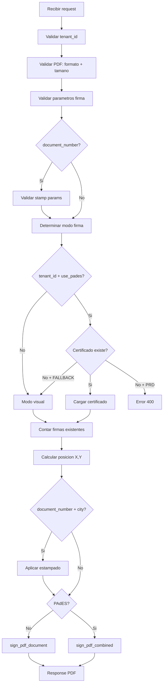

# Endpoint /sign-pdf

El endpoint principal de Notary. Firma documentos PDF con firma PAdES digital o visual,
usando layout automatico de 2 columnas.

## Request

```
POST /sign-pdf
Content-Type: multipart/form-data
X-API-Key: {api_key}
```

### Parametros (Form Data)

| Parametro | Tipo | Requerido | Descripcion |
|-----------|------|-----------|-------------|
| `pdf_file` | File | Si | PDF formato Letter (612x792 pts), max 10 MB |
| `name` | string | Si | Nombre del firmante (1-100 chars) |
| `seal` | string | Si | Cargo del firmante (1-50 chars) |
| `department` | string | Si | Departamento (1-100 chars) |
| `entity` | string | Si | Entidad (1-100 chars) |
| `document_number` | string | No | Numero de documento para estampado (max 40 chars) |
| `city` | string | Condicional | Ciudad para estampado. Requerido si `document_number` presente |
| `stamp_position` | string | No | `'first'` (default) o `'last'` |
| `tenant_id` | string | Si (PRD) | ID del tenant para buscar certificado .p12 |
| `use_pades` | string | No | `'true'` (default) o `'false'` |

!!! warning "Campos condicionales"
    - `city` es **obligatorio** cuando se envia `document_number`
    - `tenant_id` es **obligatorio** en produccion (`ENVIRONMENT=prd`)

## Response

**Exito (200):**

```
Content-Type: application/pdf
Content-Disposition: attachment; filename={document_number}.pdf
X-Signature-Type: pades | visual
```

El body es el PDF firmado en bytes.

**Header `X-Signature-Type`:**

- `pades`: Se aplico firma PAdES criptografica
- `visual`: Se aplico firma visual (sin componente criptografico)

### Nomenclatura del archivo

- Si se envio `document_number`: el archivo se llama `{document_number}.pdf`
- Si no se envio: se mantiene el nombre original del archivo subido

## Ejemplo con cURL

### Firma PAdES

```bash
curl -X POST "http://localhost:8001/sign-pdf" \
     -H "X-API-Key: miapikey" \
     -F "pdf_file=@documento.pdf" \
     -F "name=Juan Perez" \
     -F "seal=Director" \
     -F "department=Hacienda" \
     -F "entity=Municipalidad del Futuro" \
     -F "tenant_id=200_muni" \
     -F "document_number=IF-2025-00001234-MUNI" \
     -F "city=Ciudad Autonoma" \
     --output firmado.pdf
```

### Firma visual (sin certificado)

```bash
curl -X POST "http://localhost:8001/sign-pdf" \
     -H "X-API-Key: miapikey" \
     -F "pdf_file=@documento.pdf" \
     -F "name=Maria Lopez" \
     -F "seal=Secretaria" \
     -F "department=Administracion" \
     -F "entity=Municipalidad Demo" \
     -F "use_pades=false" \
     --output firmado_visual.pdf
```

## Proceso interno paso a paso



## Codigos de error

| Codigo | Error Code | Causa |
|--------|------------|-------|
| 400 | `FILE_TOO_LARGE` | PDF excede 10 MB |
| 400 | `INVALID_PDF_FILE` | No se puede leer el archivo |
| 400 | `INVALID_PDF_FORMAT` | No comienza con `%PDF` |
| 400 | `INVALID_PARAMETERS` | Parametros de firma invalidos |
| 400 | `INVALID_STAMP_PARAMETERS` | `document_number` sin `city` |
| 400 | `INVALID_STAMP_POSITION` | `stamp_position` no es `first` ni `last` |
| 400 | `INVALID_TENANT_ID` | `tenant_id` con caracteres no permitidos |
| 400 | `CERTIFICATE_NOT_FOUND` | No hay certificado y `FALLBACK_TO_VISUAL=false` |
| 400 | `CERTIFICATE_LOAD_ERROR` | Error al cargar certificado |
| 400 | `LayoutError` | No se encontro `end-text` o pagina llena (`FULLPAGE`) |
| 401 | `INVALID_API_KEY` | API Key invalida o faltante |
| 500 | `PADES_ERROR` | Error en firma PAdES |
| 500 | - | Error interno del servidor |

## Otros endpoints

### GET /health

Health check sin autenticacion.

```json
{
  "status": "healthy",
  "service": "Notary",
  "version": "2.1.0",
  "signature_system": { "type": "digital_signature", "version": "2.0" },
  "pades_system": { "type": "PAdES-B-T", "library": "pyHanko" },
  "available_certificates": ["200_muni"],
  "fallback_to_visual": true
}
```

### GET /certificate/{tenant_id}

Informacion de un certificado especifico. Requiere API Key.

```json
{
  "exists": true,
  "tenant_id": "200_muni",
  "subject": "<Name(CN=GESTION DOCUMENTAL INTELIGENTE,O=Municipalidad del Futuro)>",
  "issuer": "...",
  "not_valid_before": "2025-01-01T00:00:00+00:00",
  "not_valid_after": "2026-01-01T00:00:00+00:00",
  "is_valid": true,
  "validation_message": "Certificado valido",
  "serial_number": "..."
}
```

### GET /certificates

Lista todos los certificados disponibles. Requiere API Key.

```json
{
  "count": 1,
  "certificates": ["200_muni"]
}
```
