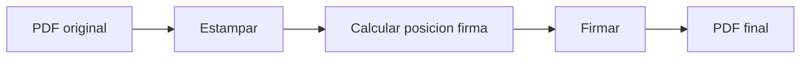

# Estampado de documentos

El modulo `app/document_stamper.py` aplica sellos informativos en documentos PDF,
agregando numero de documento, ciudad y fecha en la pagina indicada.

## Que es el estampado

El estampado agrega informacion administrativa a un PDF **antes** de la firma.
Se aplica opcionalmente cuando se envian `document_number` y `city` al endpoint `/sign-pdf`.

```
+-------------------------------------+
| Ciudad Autonoma, 15 de enero de 2025|  <-- city + fecha (Y=720)
| IF-2025-00001234-MUNI               |  <-- document_number (Y=705)
|                                      |
|         Contenido del documento      |
|                                      |
+-------------------------------------+
```

## Posicion del estampado

| Parametro | Valor | Descripcion |
|-----------|-------|-------------|
| `DOC_NUMBER_X` | 55.4 | Coordenada X |
| `DOC_NUMBER_Y` | 705 | Numero de documento (pts desde borde inferior) |
| `CITY_DATE_X` | 55.4 | Coordenada X |
| `CITY_DATE_Y` | 720 | Ciudad y fecha (pts desde borde inferior) |
| Fuente | Helvetica 11pt | Fuente del estampado |

!!! note "Posicion del sello"
    El parametro `stamp_position` controla en que pagina se aplica el estampado:

    - `'first'` (default): Primera pagina del documento
    - `'last'`: Ultima pagina del documento

## Funcion principal: stamp_document

```python
def stamp_document(
    pdf_content: bytes,
    document_number: str,
    city: str = "Bogota",
    page_position: str = "first"
) -> bytes:
```

### Proceso

1. Leer el PDF original con `PdfReader`
2. Crear overlay con el estampado (`create_stamp_overlay`)
3. Determinar la pagina objetivo segun `page_position`
4. Combinar overlay con la pagina correspondiente
5. Retornar el PDF estampado

```python
for i, page in enumerate(pdf_reader.pages):
    if page_position == "last":
        is_target = (i == total_pages - 1)
    else:  # "first" por defecto
        is_target = (i == 0)

    if is_target:
        page.merge_page(stamp_page)
    pdf_writer.add_page(page)
```

## Formato de fecha

La fecha se genera automaticamente en espanol:

```python
def format_date_spanish() -> str:
    months = [
        "enero", "febrero", "marzo", "abril", "mayo", "junio",
        "julio", "agosto", "septiembre", "octubre", "noviembre", "diciembre"
    ]
    month_name = months[now.month - 1]
    return f"{now.day} de {month_name} de {now.year}"
```

**Ejemplo:** `15 de enero de 2025`

## Texto del sello

```python
def create_stamp_text(document_number: str, city: str) -> Tuple[str, str]:
    document_line = document_number
    city_date_line = f"{city}, {format_date_spanish()}"
    return document_line, city_date_line
```

**Ejemplo de salida:**

- Linea 1 (arriba): `Ciudad Autonoma, 15 de enero de 2025`
- Linea 2 (abajo): `IF-2025-00001234-MUNI`

## Creacion del overlay

```python
def create_stamp_overlay(document_number: str, city: str) -> bytes:
    buffer = io.BytesIO()
    c = canvas.Canvas(buffer, pagesize=(612, 792))  # Letter size

    document_line, city_date_line = create_stamp_text(document_number, city)

    c.setFont("Helvetica", 11)
    c.setFillColor(black)
    c.drawString(55.4, 705, document_line)
    c.drawString(55.4, 720, city_date_line)

    c.save()
    buffer.seek(0)
    return buffer.getvalue()
```

## Orden de operaciones en /sign-pdf

El estampado se aplica **antes** de la firma:



Esto es importante porque la firma PAdES protege la integridad del documento.
Si se estampara despues de la firma, la firma quedaria invalidada.

## Excepciones

| Excepcion | Causa |
|-----------|-------|
| `StampError` | Error al leer PDF o al aplicar el overlay |
