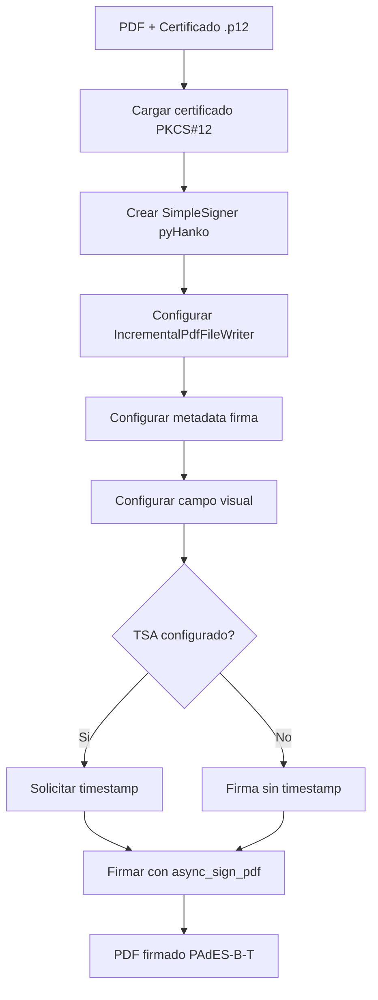

# Firma PAdES

El modulo `app/pades_signer.py` implementa la firma digital PAdES-B-T (Basic with Time)
usando la libreria **pyHanko**.

## Que es PAdES

PAdES (PDF Advanced Electronic Signatures) es un estandar de ETSI para firmas
electronicas avanzadas en documentos PDF.

**PAdES-B-T** incluye:

- Firma criptografica embebida en el PDF
- Timestamp de un servidor TSA (Time Stamping Authority)
- Hash SHA-256
- Compatible con Adobe Acrobat Reader (verificacion con clic)

## Flujo de firma PAdES



## Funcion principal: sign_pdf_combined

Esta es la funcion usada en produccion. Combina firma criptografica PAdES con
representacion visual profesional.

```python
async def sign_pdf_combined(
    pdf_content: bytes,
    cert: LoadedCertificate,
    signature_params: dict,    # name, seal, department, entity
    x: float,                  # Coordenada X (de layout.py)
    y: float,                  # Coordenada Y (de layout.py)
    existing_signature_count: int = 0,
) -> bytes:
```

### Configuracion del firmante

```python
# Crear firmante desde archivo .p12 (metodo nativo de pyHanko)
signer = signers.SimpleSigner.load_pkcs12(
    pfx_file=p12_path,
    passphrase=password.encode('utf-8'),
)
```

### Campo de firma visual

El campo se posiciona en la ultima pagina usando las coordenadas calculadas por `layout.py`:

```python
sig_field_spec = fields.SigFieldSpec(
    sig_field_name=f"GDI_Signature_{pades_count + 1}",
    on_page=last_page,
    box=(sig_x, sig_y, sig_x + SIGNATURE_WIDTH, sig_y + SIGNATURE_HEIGHT),
)
```

### Estilo del stamp visual

```python
stamp_style = TextStampStyle(
    stamp_text=(
        "%(signer_upper)s\n"
        "%(seal)s\n"
        "%(department)s\n"
        "%(entity)s"
    ),
    border_width=0,          # Sin borde
    background_opacity=0.0,  # Sin fondo
)

appearance_text_params = {
    'signer_upper': name.upper(),  # Nombre en MAYUSCULAS
    'seal': seal,
    'department': department,
    'entity': entity,
}
```

### Resultado visual

```
JUAN PEREZ
Director
Hacienda
Municipalidad del Futuro
```

- Nombre en MAYUSCULAS para destacar
- Sin borde, sin fondo
- Sin fecha visible (la fecha esta en los metadatos de la firma)

### Metadata de la firma

```python
signature_meta = signers.PdfSignatureMetadata(
    field_name=sig_field_name,
    name=name,
    reason=f"{seal} - {department}",
    location=entity,
    subfilter=fields.SigSeedSubFilter.PADES,
    md_algorithm='sha256',
)
```

La metadata es visible al hacer clic en la firma en Adobe Reader:

- **Name**: Nombre del firmante
- **Reason**: Cargo - Departamento
- **Location**: Entidad

## Timestamp (TSA)

```python
TSA_URL = os.getenv("TSA_URL", "http://timestamp.digicert.com")

def get_timestamp_client() -> Optional[timestamps.HTTPTimeStamper]:
    if not TSA_URL:
        return None
    return timestamps.HTTPTimeStamper(TSA_URL)
```

Servidores TSA publicos soportados:

| Servidor | URL |
|----------|-----|
| DigiCert | `http://timestamp.digicert.com` |
| Sectigo | `http://timestamp.sectigo.com` |
| GlobalSign | `http://timestamp.globalsign.com/tsa/r6advanced1` |

## Otras funciones

### sign_pdf_pades (solo criptografica)

Firma sin representacion visual. Usada internamente.

```python
def sign_pdf_pades(
    pdf_content: bytes,
    cert: LoadedCertificate,
    signer_name: str,
    reason: Optional[str] = None,
    location: Optional[str] = None,
    include_timestamp: bool = True,
    existing_signature_count: int = 0,
) -> bytes:
```

### count_pades_signatures

Cuenta las firmas PAdES existentes en un PDF:

```python
def count_pades_signatures(pdf_content: bytes) -> int:
    reader = PdfFileReader(io.BytesIO(pdf_content))
    return len(list(reader.embedded_signatures))
```

### verify_pades_signature

Verifica firmas PAdES existentes:

```python
def verify_pades_signature(pdf_content: bytes) -> dict:
    # Retorna: signature_count, signatures[{field_name, valid, intact, trusted}]
```

## Excepciones

| Excepcion | Causa |
|-----------|-------|
| `PAdESSigningError` | Error general de firma |
| `PAdESTimestampError` | Error al obtener timestamp del TSA |
| `PAdESCertificateError` | Certificado invalido o expirado |

## Configuracion en config.py

```python
PADES_SIGNATURE_FIELD_NAME = "GDI_Signature"   # Prefijo del campo
PADES_SIGNATURE_REASON = "Documento firmado digitalmente"
PADES_SIGNATURE_LOCATION = "Sistema GDI"
```
