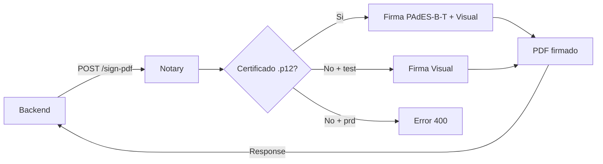
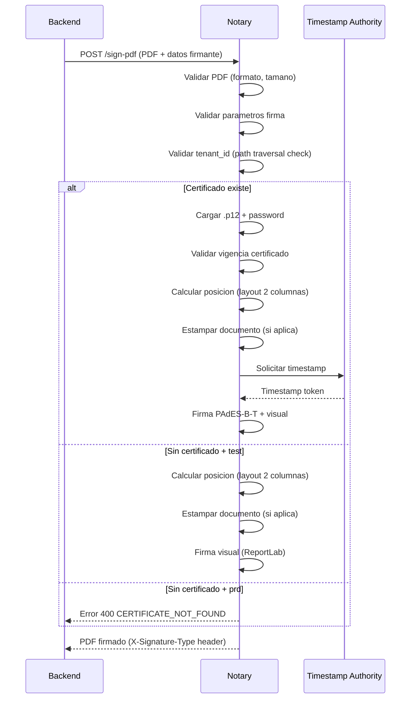

# Notary

**Servicio de firma digital de documentos PDF** con soporte PAdES y firma visual.

| Propiedad | Valor |
|-----------|-------|
| Puerto | `:8001` (desarrollo) |
| Framework | FastAPI 2.1.0 |
| Firma criptografica | pyHanko 0.25.2 (PAdES-B-T) |
| Firma visual | ReportLab + PyPDF2 |
| Analisis PDF | PyMuPDF (fitz) |
| Runtime | Python 3.11, Gunicorn 21.2.0 (3 workers) |
| Deploy | Railway (PaaS) |

## Que hace

Notary recibe un PDF y datos del firmante, aplica una firma digital (PAdES criptografica o visual)
y opcionalmente estampa informacion del documento (numero, ciudad, fecha).



## Modos de firma

### Firma PAdES (recomendado para produccion)

Firma digital criptografica embebida en el PDF, cumpliendo el estandar PAdES-B-T (Basic with Time):

- Firma criptografica con certificado PKCS#12 (.p12)
- Timestamp de servidor TSA (Time Stamping Authority)
- Representacion visual con datos del firmante
- Verificable en Adobe Acrobat Reader (clic en la firma)

### Firma Visual (solo testing)

Firma con elementos visuales (texto y lineas) sin componente criptografico:

- Nombre, cargo, departamento, entidad del firmante
- Timestamp de servidor
- No es verificable criptograficamente

## Comportamiento por ambiente

| Ambiente | `ENVIRONMENT` | `FALLBACK_TO_VISUAL` | Si no hay certificado |
|----------|---------------|----------------------|-----------------------|
| Desarrollo | `test` | `true` (default) | Usa firma visual |
| Produccion | `prd` | `false` (default) | Error 400 |

## Estructura del proyecto

```
GDI-Notary/
├── app/
│   ├── main.py                # Endpoints FastAPI
│   ├── config.py              # Constantes y configuracion
│   ├── auth.py                # Autenticacion API Key
│   ├── layout.py              # Algoritmo posicionamiento 2 columnas
│   ├── signature_inserter.py  # Firma visual (ReportLab + PyPDF2)
│   ├── document_stamper.py    # Estampado primera/ultima pagina
│   ├── validators.py          # Validaciones de entrada
│   ├── certificate_loader.py  # Carga certificados .p12 por tenant
│   └── pades_signer.py        # Firma PAdES con pyHanko
├── certs/
│   ├── {tenant_id}.p12        # Certificados por tenant
│   └── passwords.json         # Mapeo tenant -> password
├── fonts/
│   └── Roboto-Bold.ttf        # Fuente para firma visual
├── scripts/
│   └── generate_test_cert.py  # Genera certificados de prueba
├── gunicorn_conf.py           # Config produccion
├── Dockerfile
└── requirements.txt
```

## Endpoints

| Endpoint | Metodo | Auth | Descripcion |
|----------|--------|------|-------------|
| `/sign-pdf` | POST | Si | Firma PDF (PAdES o visual) |
| `/health` | GET | No | Health check |
| `/certificate/{tenant_id}` | GET | Si | Info de certificado |
| `/certificates` | GET | Si | Lista certificados |

## Variables de entorno

| Variable | Test | Produccion | Descripcion |
|----------|------|------------|-------------|
| `ENVIRONMENT` | `test` | `prd` | Ambiente de ejecucion |
| `API_KEY` | `miapikey` | (secreto) | API Key de autenticacion |
| `CERTS_DIR` | `./certs` | `./certs` | Directorio de certificados |
| `TSA_URL` | `http://timestamp.digicert.com` | (igual) | Servidor de timestamp |
| `FALLBACK_TO_VISUAL` | `true` | `false` | Firma visual si no hay cert |
| `GUNICORN_WORKERS` | `3` | `3` | Workers de Gunicorn |
| `GUNICORN_TIMEOUT` | `90` | `90` | Timeout en segundos |

## Flujo completo de firma


