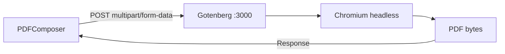

# Integracion con Gotenberg

PDFComposer utiliza **Gotenberg 7** como motor de conversion HTML a PDF.
Gotenberg ejecuta internamente un navegador Chromium para renderizar el HTML
y producir PDFs de alta fidelidad.

## Arquitectura



Gotenberg corre como servicio independiente en Railway y se comunica via la red interna.

## Configuracion de URL

La URL de Gotenberg se configura via variable de entorno y se sanitiza automaticamente:

```python
# app/config.py
def get_gotenberg_url() -> str:
    return _clean_url(
        os.getenv("GOTENBERG_URL"),
        "http://gotenberg.railway.internal:3000",
    )
```

La funcion `_clean_url` normaliza la URL:

- Agrega `http://` si falta el esquema
- Agrega puerto `:3000` si no tiene puerto explicito
- Elimina slash trailing del path

| Ambiente | URL |
|----------|-----|
| Railway (produccion) | `http://gotenberg.railway.internal:3000` |
| Docker local | `http://gotenberg:3000` |
| Desarrollo local | `http://localhost:3000` |

## Endpoint utilizado

PDFComposer usa exclusivamente el endpoint de conversion HTML de Chromium:

```
POST {GOTENBERG_URL}/forms/chromium/convert/html
```

**Request:**

- Content-Type: `multipart/form-data`
- Archivo: `index.html` (nombre obligatorio)

```python
files = {'index.html': ('index.html', html_content, 'text/html')}
response = requests.post(api_endpoint, files=files, timeout=DEFAULT_TIMEOUT)
```

**Response:**

- Content-Type: `application/pdf`
- Body: PDF bytes

## Timeout

El timeout se configura via variable de entorno `DEFAULT_TIMEOUT` (default: 30 segundos).

```python
DEFAULT_TIMEOUT = int(_clean_val(os.getenv("DEFAULT_TIMEOUT")) or "30")
```

!!! warning "PDFs complejos"
    Documentos con muchas imagenes o tablas complejas pueden requerir
    mas de 30 segundos. Considerar aumentar el timeout si se producen
    errores 504 frecuentes.

## Docker Compose (desarrollo local)

Para desarrollo local, Gotenberg se ejecuta como contenedor Docker:

```yaml
services:
  gotenberg:
    image: gotenberg/gotenberg:7
    ports:
      - "3000:3000"
    command:
      - "gotenberg"
      - "--api-timeout=60s"
      - "--chromium-auto-start"
```

!!! info "Railway"
    En Railway, Gotenberg se despliega como servicio independiente.
    Se comunica con PDFComposer via la red interna (`*.railway.internal`).

## Health Check

PDFComposer verifica el estado de Gotenberg en el endpoint `/health/details`:

```python
@app.get("/health/details")
async def health_details(api_key: str = Depends(verify_api_key)):
    gotenberg_status = "unknown"
    base = get_gotenberg_url()
    try:
        r = requests.get(f"{base}/health", timeout=3)
        gotenberg_status = "ok" if r.status_code < 500 else "down"
    except Exception:
        try:
            r2 = requests.get(base, timeout=3)
            gotenberg_status = "ok" if r2.status_code < 500 else "down"
        except Exception:
            gotenberg_status = "down"
    overall = "healthy" if gotenberg_status == "ok" else "degraded"
    return {
        "status": overall,
        "service": "pdfcomposer",
        "version": "2.3.0",
        "gotenberg": gotenberg_status,
    }
```

Primero intenta `GET /health` de Gotenberg. Si falla, intenta la raiz `/`.
Si ambos fallan, reporta `gotenberg: "down"` y el estado general como `"degraded"`.

## Gunicorn en produccion

PDFComposer usa Gunicorn con Uvicorn workers para produccion:

```python
# gunicorn_conf.py
port = os.getenv("PORT", "8000")
bind = f"[::]:{port}"                         # IPv6 (acepta tambien IPv4)
workers = int(os.getenv("GUNICORN_WORKERS", "4"))
worker_class = "uvicorn.workers.UvicornWorker" # Compatible con async FastAPI
timeout = int(os.getenv("GUNICORN_TIMEOUT", "120"))
max_requests = int(os.getenv("GUNICORN_MAX_REQUESTS", "1000"))
max_requests_jitter = 50                       # Evita restart simultaneo
graceful_timeout = 30
```

| Parametro | Valor | Proposito |
|-----------|-------|-----------|
| `bind` | `[::]:{PORT}` | IPv6 para networking interno Railway |
| `workers` | 4 | Instancias paralelas |
| `timeout` | 120s | Margen para PDFs complejos |
| `max_requests` | 1000 | Prevenir memory leaks |
| `max_requests_jitter` | 50 | Evitar restart simultaneo de workers |

## Errores comunes

| Sintoma | Causa | Solucion |
|---------|-------|----------|
| `Connection refused` | Gotenberg caido | `railway restart --service gotenberg` |
| Timeout (504) | PDF complejo o Gotenberg saturado | Aumentar `DEFAULT_TIMEOUT` |
| HTML no renderiza correctamente | CSS no compatible con Chromium | Agregar `-webkit-print-color-adjust: exact` |
| Imagenes no aparecen | URL de imagen no accesible desde Gotenberg | Convertir imagenes a base64 antes de enviar |
