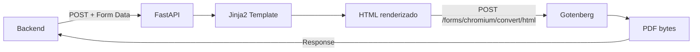

# PDFComposer

**Servicio de generacion de documentos PDF** basado en FastAPI y Gotenberg.

| Propiedad | Valor |
|-----------|-------|
| Puerto | `:8002` (desarrollo) |
| Framework | FastAPI 2.3.0 |
| Motor PDF | Gotenberg 7 (Chromium) |
| Templates | Jinja2 (HTML/CSS) |
| Runtime | Python 3.13, Gunicorn + Uvicorn workers |
| Deploy | Railway (PaaS) |

## Que hace

PDFComposer recibe datos estructurados via API REST, los inyecta en templates HTML con Jinja2,
y envia el HTML resultante a **Gotenberg** para su conversion a PDF.



## Tipos de documento soportados

| Tipo | Endpoint | Template | Descripcion |
|------|----------|----------|-------------|
| Preview | `POST /preview-pdf/` | `plantilla.html` | Documento con marca de agua diagonal |
| Documento final | `POST /generate-pdf/` | `generate-pdf.html` | Documento oficial sin marca de agua |
| Caratula CAEX | `POST /create-case/` | `caratula.html` | Caratula de expediente con fecha automatica |
| Pase de vista | `POST /move/` | `movimiento.html` | Pase entre areas (DE -> A) |
| Importacion | `POST /import/` | `Importado.html` | Pagina informativa para PDFs externos |
| Nota preview | `POST /note-preview/` | `nota_preview.html` | Nota con marca de agua |
| Nota final | `POST /note/` | `nota.html` | Nota oficial sin marca de agua |

## Estructura del proyecto

```
GDI-PDFComposer/
├── main.py                     # Endpoints FastAPI
├── gunicorn_conf.py            # Config produccion (4 workers, IPv6)
├── app/
│   ├── config.py               # Variables de entorno y constantes
│   ├── models/
│   │   └── pdf_models.py       # Modelos Pydantic (5 modelos)
│   ├── services/
│   │   └── pdf_service.py      # Logica de negocio y comunicacion con Gotenberg
│   └── templates/              # Templates HTML/CSS Jinja2
│       ├── plantilla.html      # Preview con marca de agua
│       ├── generate-pdf.html   # Documento final
│       ├── caratula.html       # Caratula de expediente
│       ├── movimiento.html     # Pases entre areas
│       ├── Importado.html      # Pagina informativa de importacion
│       ├── nota.html           # Nota final
│       └── nota_preview.html   # Nota con marca de agua
└── tests/
    └── test_security.py        # Tests de seguridad
```

## Seguridad

- Todos los endpoints (excepto `/health`) requieren header `X-API-Key`
- Validacion con comparacion constante (`hmac.compare_digest`) para prevenir timing attacks
- Sanitizacion HTML con `nh3` (tags permitidos del editor Quill)
- Proteccion SSRF en descarga de logos (bloqueo de IPs privadas y hostnames internos)
- Documentacion Swagger deshabilitada en produccion

## Variables de entorno

| Variable | Ejemplo | Requerida | Descripcion |
|----------|---------|-----------|-------------|
| `API_KEY` | `mi-api-key-segura` | Si | API Key para autenticacion |
| `GOTENBERG_URL` | `http://gotenberg.railway.internal:3000` | Si | URL de Gotenberg |
| `DEFAULT_TIMEOUT` | `30` | No | Timeout para requests a Gotenberg (default: 30s) |
| `ENV` | `production` | No | Entorno (`production` deshabilita Swagger) |
| `GUNICORN_WORKERS` | `4` | No | Workers de Gunicorn (default: 4) |
| `PORT` | `8002` | No | Railway lo inyecta automaticamente |

## Comandos de desarrollo

```bash
# Desarrollo local con hot reload
python main.py

# Produccion local
gunicorn main:app -c gunicorn_conf.py

# Test rapido
curl -X POST "http://localhost:8002/preview-pdf/" \
     -H "X-API-Key: miapikey" \
     -F "NameAcronyType=GDI" \
     -F "TypeDocument=TEST" \
     -F "Reference=REF-001" \
     -F 'Text={"html": "<p>Contenido</p>"}' \
     --output test.pdf
```
