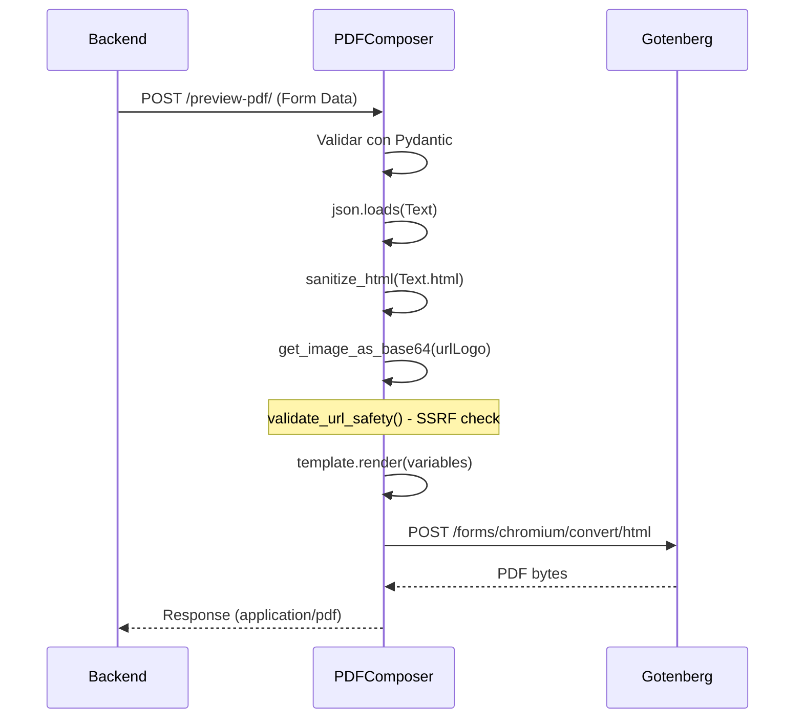

# Servicio de generacion PDF

La logica de negocio se centraliza en `app/services/pdf_service.py`. Este modulo se encarga
de renderizar templates, comunicarse con Gotenberg, sanitizar contenido y manejar logos.

## Funciones principales

### generate_pdf_from_html

Funcion central que envia HTML a Gotenberg para su conversion a PDF.

```python
def generate_pdf_from_html(html_content: str) -> bytes:
    gotenberg_url = get_gotenberg_url()
    api_endpoint = f"{gotenberg_url.rstrip('/')}/forms/chromium/convert/html"

    # El archivo debe llamarse 'index.html' como lo requiere Gotenberg
    files = {'index.html': ('index.html', html_content, 'text/html')}

    response = requests.post(api_endpoint, files=files, timeout=DEFAULT_TIMEOUT)
    response.raise_for_status()
    return response.content
```

!!! note "Requisito de Gotenberg"
    El archivo HTML enviado a Gotenberg **debe** llamarse `index.html`.
    Este es un requisito del endpoint `/forms/chromium/convert/html`.

---

### Funciones de generacion por tipo

Cada tipo de documento tiene su propia funcion que sigue el mismo patron:

1. Convertir logo URL a base64 (si se proporciona)
2. Sanitizar contenido HTML del usuario
3. Cargar template Jinja2
4. Renderizar HTML con variables
5. Enviar a Gotenberg

| Funcion | Template | Proposito |
|---------|----------|-----------|
| `generate_preview_pdf()` | `plantilla.html` | Preview con marca de agua |
| `generate_general_pdf()` | `generate-pdf.html` | Documento final |
| `generate_case_pdf()` | `caratula.html` | Caratula CAEX |
| `generate_move_pdf()` | `movimiento.html` | Pase de vista |
| `generate_import_pdf()` | `Importado.html` | Pagina informativa |
| `generate_note_pdf()` | `nota.html` | Nota final |
| `generate_note_preview_pdf()` | `nota_preview.html` | Nota preview |

---

## Sanitizacion HTML

```python
def sanitize_html(html_content: str) -> str:
    if not html_content:
        return ""
    return nh3.clean(
        html_content,
        tags=ALLOWED_TAGS,
        attributes=ALLOWED_ATTRIBUTES,
    )
```

La sanitizacion se aplica al contenido del campo `Text.html` antes de inyectarlo en el template.
Utiliza la libreria `nh3` (port de ammonia en Rust) que es mas rapida y segura que bleach.

---

## Proteccion SSRF para logos

Antes de descargar un logo desde una URL externa, se valida que la URL sea segura:

```python
def validate_url_safety(url: str) -> None:
    parsed = urlparse(url)

    # Solo HTTP/HTTPS
    if parsed.scheme not in ("http", "https"):
        raise ValueError(f"Scheme no permitido: {parsed.scheme}")

    # Bloquear hostnames conocidos
    hostname_lower = hostname.lower()
    if hostname_lower in BLOCKED_HOSTNAMES:
        raise ValueError(f"Hostname bloqueado: {hostname}")

    # Bloquear dominios Railway internos
    if hostname_lower.endswith(".railway.internal"):
        raise ValueError(f"Hostname interno bloqueado: {hostname}")

    # Resolver y verificar que no sea IP privada
    addr_infos = socket.getaddrinfo(hostname, None)
    for addr_info in addr_infos:
        ip = ipaddress.ip_address(addr_info[4][0])
        if ip.is_private or ip.is_loopback or ip.is_link_local or ip.is_reserved:
            raise ValueError(f"IP privada/reservada bloqueada: {ip}")
```

**Hostnames bloqueados:**

- `localhost`
- `metadata.google.internal`
- Cualquier hostname `*.railway.internal`

---

## Merge de PDFs

La funcion `merge_pdfs` se usa en `/generate-pdf/` cuando se envia un archivo adjunto:

```python
def merge_pdfs(base_pdf: bytes, attachment_pdf: bytes) -> bytes:
    doc_base = fitz.open(stream=base_pdf, filetype="pdf")
    doc_attachment = fitz.open(stream=attachment_pdf, filetype="pdf")
    doc_base.insert_pdf(doc_attachment)
    merged_pdf = doc_base.tobytes()
    doc_base.close()
    doc_attachment.close()
    return merged_pdf
```

Utiliza **PyMuPDF** (`fitz`) para concatenar las paginas del adjunto al final del PDF base.

---

## Texto ancla "end-text"

La funcion `find_text_position_in_pdf` busca el texto `"end-text"` en un PDF para determinar
donde terminan los contenidos. Este marcador es critico para el sistema de firma de Notary.

```python
SIGNATURE_ANCHOR_TEXT = "end-text"

def find_text_position_in_pdf(pdf_bytes: bytes, text_to_find: str) -> Optional[float]:
    with pdfplumber.open(io.BytesIO(pdf_bytes)) as pdf:
        for page in pdf.pages:
            words = page.extract_words()
            for word in words:
                if word.get("text") == text_to_find:
                    return word.get("top")
    return None
```

!!! tip "Relacion con Notary"
    El texto `"end-text"` es generado por los templates HTML de PDFComposer.
    Notary luego busca este texto para posicionar las firmas digitales debajo de el.

---

## Flujo completo de generacion


