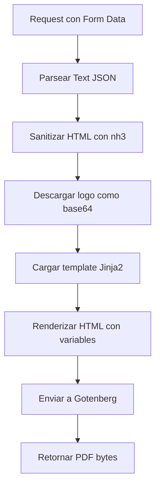

# Templates Jinja2

PDFComposer utiliza **Jinja2** para renderizar templates HTML que luego se convierten a PDF via Gotenberg.
Los templates estan en `app/templates/` y se cargan con `autoescape=True` para prevenir XSS.

## Motor de templates

```python
from jinja2 import Environment, FileSystemLoader

templates_dir = Path(__file__).parent.parent / "templates"
env = Environment(loader=FileSystemLoader(templates_dir), autoescape=True)
```

!!! warning "Autoescape habilitado"
    Jinja2 esta configurado con `autoescape=True`. El contenido HTML del usuario
    se sanitiza previamente con `nh3` y se pasa al template ya limpio.

## Templates disponibles

### plantilla.html (Preview)

Template para previsualizacion de documentos. Incluye una marca de agua diagonal obligatoria.

**Variables:**

| Variable | Tipo | Descripcion |
|----------|------|-------------|
| `logo_data` | string / None | Logo en formato base64 data URI |
| `name_acrony_type` | string | Acronimo del tipo (ej. `GDI`) |
| `document_type` | string | Tipo de documento |
| `reference` | string | Referencia del documento |
| `text` | string | Contenido HTML sanitizado |

!!! note "Marca de agua obligatoria"
    Este template SIEMPRE debe contener:
    ```html
    <div class="watermark">PREVISUALIZACION</div>
    ```

---

### generate-pdf.html (Documento final)

Template para el documento oficial. Campos de fecha y numero se renderizan con `color: white`
para que queden en blanco y se completen manualmente despues.

**Variables:** Mismas que `plantilla.html`.

---

### caratula.html (Caratula CAEX)

Template para caratulas de expediente. La fecha se genera automaticamente en el backend.

**Variables:**

| Variable | Tipo | Descripcion |
|----------|------|-------------|
| `logo_data` | string / None | Logo en formato base64 data URI |
| `name_acrony_type` | string | Acronimo del tipo |
| `document_type` | string | Tipo de documento |
| `reference` | string | Referencia |
| `numero_expediente` | string | Numero de expediente |
| `acrony_case_type` | string | Acronimo del tipo de expediente |
| `tipo_expediente` | string | Tipo de expediente |
| `motivo_expediente` | string | Motivo del expediente |
| `reparticion_iniciadora` | string | Reparticion iniciadora |
| `fecha_caratulacion` | string | Fecha UTC generada automaticamente |
| `caratulador` | string | Nombre del caratulador |

---

### movimiento.html (Pase de vista)

Template para pases entre areas (DE -> A).

**Variables:**

| Variable | Tipo | Descripcion |
|----------|------|-------------|
| `logo_data` | string / None | Logo en formato base64 data URI |
| `name_acrony_type` | string | Acronimo del tipo |
| `document_type` | string | Tipo de documento |
| `reference` | string | Referencia |
| `tipo_movimiento` | string | Tipo de movimiento |
| `area_requiriente` | string | Area que envia (DE) |
| `area_receptora` | string | Area que recibe (A) |
| `motivo` | string | Motivo del movimiento |

---

### Importado.html (Pagina informativa)

Template para la pagina informativa que se anexa a PDFs importados.

**Variables:**

| Variable | Tipo | Descripcion |
|----------|------|-------------|
| `logo_data` | string / None | Logo en formato base64 data URI |
| `name_acrony_type` | string | Acronimo del tipo |
| `document_type` | string | Tipo de documento |
| `reference` | string | Referencia |
| `cantidad_paginas` | int | Cantidad de paginas del PDF original |

---

### nota.html / nota_preview.html (Notas)

Templates para notas oficiales. La version preview incluye marca de agua.

**Variables:**

| Variable | Tipo | Descripcion |
|----------|------|-------------|
| `logo_data` | string / None | Logo en formato base64 data URI |
| `name_acrony_type` | string | Acronimo del tipo |
| `document_type` | string | Tipo de documento |
| `reference` | string | Referencia |
| `para` | string / None | Destinatario principal (PARA) |
| `cc` | string / None | Destinatarios en copia (CC) |
| `text_html` | string | Contenido HTML sanitizado |

## Flujo de renderizado



## Sanitizacion HTML

El contenido HTML del usuario se sanitiza con la libreria `nh3` antes de inyectarlo en el template.

**Tags permitidos:**

```python
ALLOWED_TAGS = {
    "p", "br", "strong", "em", "u", "s", "ol", "ul", "li",
    "h1", "h2", "h3", "h4", "h5", "h6", "blockquote", "pre", "code",
    "a", "img", "span", "div", "table", "thead", "tbody", "tr", "td", "th",
    "sub", "sup", "hr",
}
```

**Atributos permitidos:**

```python
ALLOWED_ATTRIBUTES = {
    "a": {"href"},
    "img": {"src", "alt", "width", "height"},
    "td": {"colspan", "rowspan"},
    "th": {"colspan", "rowspan"},
    "*": {"class", "style"},
}
```

!!! danger "Tags eliminados automaticamente"
    `<script>`, `<iframe>`, `<object>`, `<embed>`, event handlers (`onclick`, etc.)
    son eliminados automaticamente por `nh3`.

## Manejo de logos

Los logos se descargan desde una URL publica y se convierten a base64 antes de inyectarlos en el HTML.
Esto es necesario porque Gotenberg no puede resolver URLs externas al renderizar.

```python
def get_image_as_base64(url: str) -> Union[str, None]:
    validate_url_safety(url)  # Proteccion SSRF
    response = requests.get(url, timeout=DEFAULT_TIMEOUT)
    image_data = base64.b64encode(response.content).decode('utf-8')
    content_type = response.headers.get('Content-Type', 'image/png')
    return f"data:{content_type};base64,{image_data}"
```

## Reglas CSS para impresion

Todos los templates deben incluir en el `<body>`:

```css
-webkit-print-color-adjust: exact;
```

Esto asegura que los colores de fondo y bordes se rendericen correctamente
en el motor Chromium de Gotenberg.
